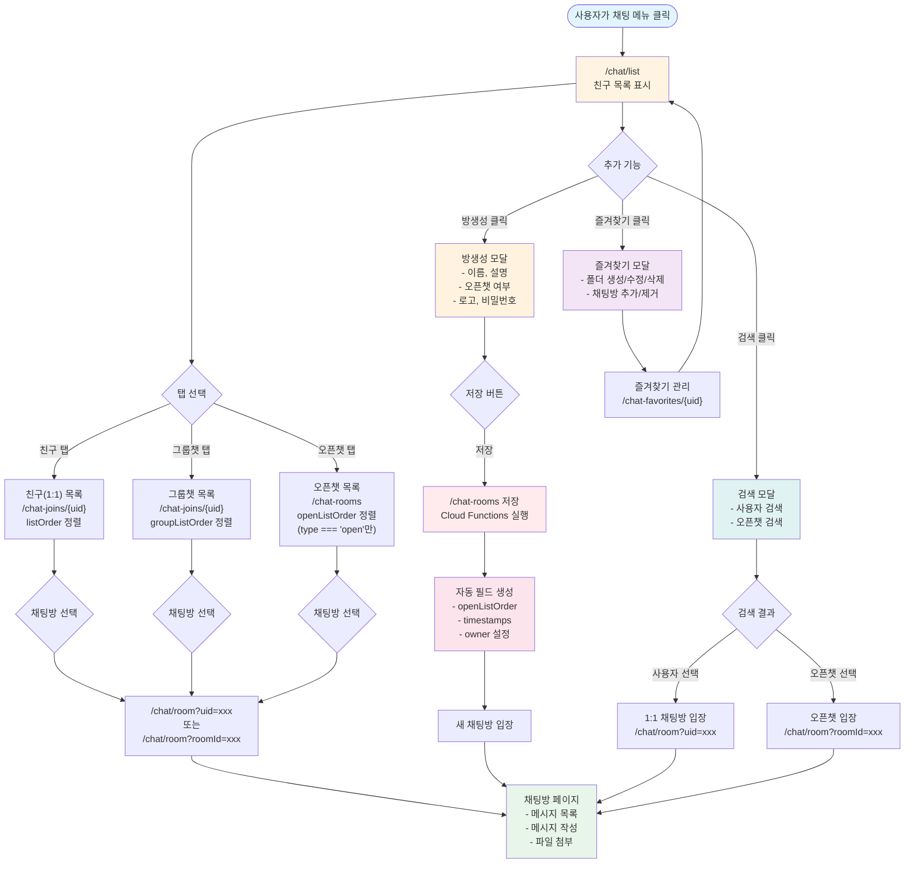

- [워크플로우](#워크플로우)
  - [📋 문서의 범위](#-문서의-범위)
  - [🎯 핵심 설계 개념](#-핵심-설계-개념)
  - [클라이언트와 백엔드의 역할 분리](#클라이언트와-백엔드의-역할-분리)
- [개요](#개요)
- [채팅방 시스템](#채팅방-시스템)
  - [채팅방 타입](#채팅방-타입)
    - [1. **1:1 채팅방** (일대일 채팅)](#1-11-채팅방-일대일-채팅)
    - [2. **그룹 채팅방** (Group Chat)](#2-그룹-채팅방-group-chat)
    - [3. **오픈 채팅방** (Open Chat)](#3-오픈-채팅방-open-chat)
    - [4. **서브 채팅방** (Sub Chat Room)](#4-서브-채팅방-sub-chat-room)
  - [권한 관리 (Role)](#권한-관리-role)
    - [**Owner** (채팅방 생성자)](#owner-채팅방-생성자)
    - [**Moderator** (관리자)](#moderator-관리자)
    - [**Member** (일반 멤버)](#member-일반-멤버)
  - [서브 채팅방 구조](#서브-채팅방-구조)
- [채팅방 순서도](#채팅방-순서도)
  - [채팅 UI 흐름 개요](#채팅-ui-흐름-개요)
  - [채팅방 목록 페이지 구조](#채팅방-목록-페이지-구조)
    - [상단 메뉴 구성](#상단-메뉴-구성)
  - [채팅방 목록 조회 방식](#채팅방-목록-조회-방식)
    - [1. 친구(1:1 채팅) 목록](#1-친구11-채팅-목록)
    - [2. 그룹챗 목록](#2-그룹챗-목록)
    - [3. 오픈챗 목록](#3-오픈챗-목록)
  - [채팅방 입장](#채팅방-입장)
  - [방생성 기능](#방생성-기능)
    - [Cloud Functions + 보안 규칙이 owner를 보장하는 방식](#cloud-functions--보안-규칙이-owner를-보장하는-방식)
  - [즐겨찾기 기능](#즐겨찾기-기능)
  - [검색 기능](#검색-기능)
  - [전체 흐름도 (Mermaid)](#전체-흐름도-mermaid)
  - [데이터 흐름 요약](#데이터-흐름-요약)
    - [채팅방 목록 조회](#채팅방-목록-조회)
    - [정렬 필드 생성 주체](#정렬-필드-생성-주체)
- [메시지 시스템](#메시지-시스템)
  - [메시지 타입](#메시지-타입)
    - [**message** (일반 메시지)](#message-일반-메시지)
    - [**post** (게시글 형식 메시지)](#post-게시글-형식-메시지)
  - [메시지 저장 구조](#메시지-저장-구조)
  - [메시지 Order 필드](#메시지-order-필드)
    - [**roomOrder**](#roomorder)
    - [**rootOrder**](#rootorder)
    - [**openOrder**](#openorder)
    - [**categoryOrder**](#categoryorder)
  - [메시지 생명주기](#메시지-생명주기)
- [게시판 통합](#게시판-통합)
  - [게시판과 채팅의 통합 방식](#게시판과-채팅의-통합-방식)
  - [게시판 조회 전략](#게시판-조회-전략)
    - [**채팅 목록**](#채팅-목록)
    - [**게시판 목록 (type: "post"만)**](#게시판-목록-type-post만)
- [설계 원칙](#설계-원칙)
  - [1. Flat Style 구조](#1-flat-style-구조)
  - [2. Order 필드 기반 정렬](#2-order-필드-기반-정렬)
  - [3. 최소 정보 저장](#3-최소-정보-저장)
  - [4. Cloud Functions 활용](#4-cloud-functions-활용)
- [향후 개발 항목](#향후-개발-항목)
  - [**알림 (Notification) 시스템**](#알림-notification-시스템)
- [관련 가이드 문서](#관련-가이드-문서)
- [참고 자료](#참고-자료)
- [작업 이력 (SED Log)](#작업-이력-sed-log)

---

## 워크플로우

### 📋 문서의 범위

본 문서는 **채팅 및 게시판 통합 시스템의 아키텍처와 데이터 구조 개요**를 제공합니다.

- ✅ **포함되는 내용**:
  - 채팅방 타입과 특징
  - 메시지 저장 구조 및 필드 정의
  - 게시판 통합 메커니즘
  - 서브 채팅방 기능과 제약사항
  - 권한 관리 (owner, moderator, member)
  - Order 필드의 역할과 쿼리 전략

- ❌ **포함되지 않는 내용**:
  - 구체적인 구현 코드 예제
  - 상세한 UI/UX 가이드
  - Cloud Functions 구현 상세

**Firebase 데이터베이스 구조는** [sonub-firebase-database-structure.md](specs/sonub-firebase-database-structure.md)를 참고하세요.

### 🎯 핵심 설계 개념

1. **채팅 = 게시판**: 일반 메시지와 게시글이 동일한 채팅방에 함께 저장됨
2. **Flat 구조**: 모든 메시지는 `/chat-messages/{messageId}` 형태로 1단계 깊이로만 저장
3. **Order 기반 정렬**: Firebase RTDB의 제한된 쿼리 능력을 보완하기 위해 다양한 order 필드 사용
4. **계층적 채팅방**: 부모 채팅방 아래에 서브 채팅방을 구성 가능 (최대 2단계)
5. **최소 정보 저장**: 클라이언트는 기본 정보만 저장, 추가 처리는 Cloud Functions에서 처리

### 클라이언트와 백엔드의 역할 분리

**클라이언트의 역할:**
- ✅ 메시지 기본 정보만 저장 (text, urls, type, senderUid, timestamps)
- ✅ 사용자가 직접 입력한 데이터 (게시글 제목, 내용 등)
- ❌ 사용자 정보 (displayName, photoUrl) 저장 금지
- ❌ 추가 메타데이터 자동 생성 금지

**백엔드(Cloud Functions)의 역할:**
- ✅ Order 필드 자동 생성
- ✅ 타임스탬프 기반 데이터 검증
- ✅ 메시지 관련 부가 정보 생성
- ✅ 채팅방 통계 및 메타데이터 관리

---

## 개요

Sonub의 채팅 시스템은 **일반 메시징과 게시판 기능을 통합**한 혁신적 설계입니다.

사용자는 채팅방에 입장하면:
- **일반 채팅 메시지**로 실시간 대화
- **게시글 형식 메시지**로 구조화된 정보 공유

이 두 가지 형태의 메시지가 동일한 데이터베이스에 함께 저장되며, 조회 방식에 따라 채팅 목록 또는 게시판 목록으로 표시됩니다.

---

## 채팅방 시스템

### 채팅방 타입

#### 1. **1:1 채팅방** (일대일 채팅)
- 두 사용자 간의 비공개 채팅
- 데이터 위치: `/chat-joins/{myUid}/{roomId}` ([필드 구조 보기](specs/sonub-firebase-database-structure.md#채팅방-참여-chat-joins))
- **서브 채팅방 미지원**: 1:1 채팅방은 계층 구조가 없음
- 검색 및 목록에 미포함

#### 2. **그룹 채팅방** (Group Chat)
- 초대된 사용자들만 입장 가능한 채팅방
- 데이터 위치: `/chat-rooms/{roomId}` ([필드 구조 보기](specs/sonub-firebase-database-structure.md#채팅방-chat-rooms))
- 검색이나 채팅방 목록에 **미포함**
- **서브 채팅방 지원**: Owner/Moderator가 서브 채팅방 생성 가능
- 예: 팀 채팅, 프로젝트 그룹

#### 3. **오픈 채팅방** (Open Chat)
- 누구나 입장 가능한 공개 채팅방
- 데이터 위치: `/chat-rooms/{roomId}` ([필드 구조 보기](specs/sonub-firebase-database-structure.md#채팅방-chat-rooms))
- 검색 및 채팅방 목록에 **포함됨**
- **서브 채팅방 지원**: Owner/Moderator가 서브 채팅방 생성 가능
- 예: 공개 커뮤니티, 공지사항 채팅방

#### 4. **서브 채팅방** (Sub Chat Room)
- 그룹/오픈 채팅방 아래에 연결된 하위 채팅방
- 데이터 위치: `/chat-rooms/{roomId}` (parentRoomId 필드 포함, [구조 참고](specs/sonub-firebase-database-structure.md#채팅방-chat-rooms))
- 부모 채팅방의 메시지는 서브 채팅방으로 **전파되지 않음**
- 서브 채팅방의 메시지는 부모 채팅방에서 **모두 표시 가능** (rootOrder 사용)
- 예: 공지사항, 토론방, 질문방
- **제약사항**:
  - 최대 2단계만 지원 (부모 > 자식)
  - 서브 채팅방은 다른 채팅방을 부모로 가질 수 없음
  - 부모 채팅방은 하나만 가능

### 권한 관리 (Role)

#### **Owner** (채팅방 생성자)
- 채팅방 생성 및 삭제 권한
- Moderator 추가/제거 권한
- 멤버 추가/제거 권한
- 서브 채팅방 생성 권한
- 채팅방 정보 수정 권한

#### **Moderator** (관리자)
- Owner에 의해 추가됨
- 멤버 추가/제거 권한
- 서브 채팅방 생성 권한
- 메시지 삭제 권한 (필요시)

#### **Member** (일반 멤버)
- 채팅 메시지 작성 권한
- 게시글 작성 권한
- `/chat-rooms/{roomId}/users` 배열에 UID로 저장

### 서브 채팅방 구조

서브 채팅방은 **완전히 독립된 하나의 채팅방**으로 운영됩니다.

**특징:**
- 각 서브 채팅방은 자체 메시지, 메타데이터, 멤버를 독립적으로 관리
- `/chat-rooms/{subRoomId}/parentRoomId` 필드로 부모 채팅방 추적
- 부모 채팅방에서 하위 채팅방의 메시지를 모두 볼 수 있음 (rootOrder 사용)

**활용 예시:**
```
필리핀 (부모 채팅방)
├── 마닐라 (서브 채팅방)
└── 세부 (서브 채팅방)
```

마닐라와 세부에서 작성되는 메시지는:
- 각 채팅방의 채팅 목록에 표시 (roomOrder 사용)
- 필리핀 부모 채팅방에서도 모두 조회 가능 (rootOrder 사용)

---

## 채팅방 순서도

### 채팅 UI 흐름 개요

사용자가 채팅 기능을 사용하는 전체 흐름은 다음과 같습니다:

1. **진입점**: 사용자가 채팅 메뉴를 클릭하면 `/chat/list` 페이지로 이동
2. **기본 화면**: 친구(1:1 채팅) 목록이 기본으로 표시됨
3. **목록 전환**: 상단 탭을 통해 그룹챗, 오픈챗 목록으로 전환 가능
4. **채팅방 입장**: 목록에서 채팅방을 선택하면 `/chat/room` 페이지로 이동
5. **추가 기능**: 방생성, 즐겨찾기, 검색 등의 부가 기능 제공

### 채팅방 목록 페이지 구조

#### 상단 메뉴 구성

채팅 목록 페이지(`/chat/list`) 상단에는 다음과 같은 메뉴가 제공됩니다:

```
[친구] [그룹챗] [오픈챗] _________________ [방생성] [설정⚙️]
                                                   └─ 즐겨찾기
                                                   └─ 검색
```

**메뉴 설명:**
- **친구**: 1:1 채팅방 목록 표시
- **그룹챗**: 내가 참여한 그룹 채팅방 목록 표시
- **오픈챗**: 공개된 오픈 채팅방 목록 표시
- **방생성**: 새로운 그룹/오픈 채팅방 생성
- **즐겨찾기**: 즐겨찾기한 채팅방 관리
- **검색**: 사용자 또는 채팅방 검색

**컴포넌트 구현:**

상단 메뉴는 재사용 가능한 컴포넌트로 구현되어 있습니다:

- **파일 위치**: `/src/lib/components/chat/ChatListMenu.svelte`
- **사용 페이지**:
  - `/src/routes/chat/list/+page.svelte` (친구/1:1 채팅 목록)
  - `/src/routes/chat/group-chat-list/+page.svelte` (그룹챗 목록)
  - `/src/routes/chat/open-chat-list/+page.svelte` (오픈챗 목록)

**컴포넌트 Props:**

```typescript
interface Props {
  /** 현재 선택된 탭 ('friends' | 'groupChats' | 'openChats') */
  selectedTab: TabType;
  /** 방생성 버튼 클릭 콜백 (optional) */
  onCreateRoom?: () => void;
  /** 북마크 메뉴 클릭 콜백 (optional) */
  onBookmark?: () => void;
  /** 검색 메뉴 클릭 콜백 (optional) */
  onSearch?: () => void;
}
```

**사용 예시:**

```svelte
<!-- 친구 목록 페이지 -->
<ChatListMenu
  selectedTab="friends"
  onCreateRoom={handleCreateRoom}
  onBookmark={handleBookmark}
  onSearch={handleSearch}
/>

<!-- 그룹챗 목록 페이지 -->
<ChatListMenu
  selectedTab="groupChats"
  onCreateRoom={handleCreateRoom}
  onBookmark={handleBookmark}
  onSearch={handleSearch}
/>

<!-- 오픈챗 목록 페이지 -->
<ChatListMenu
  selectedTab="openChats"
  onCreateRoom={handleCreateRoom}
  onBookmark={handleBookmark}
  onSearch={handleSearch}
/>
```

**주요 기능:**
- Svelte 5의 `$state` 및 `$props` runes 사용
- **탭 클릭 시 페이지 이동**: 각 탭을 클릭하면 해당 페이지로 자동 이동
  - 친구 탭 → `/chat/list`
  - 그룹챗 탭 → `/chat/group-chat-list`
  - 오픈챗 탭 → `/chat/open-chat-list`
- 탭 전환 시 시각적 피드백 제공 (active 상태 스타일)
- 설정 드롭다운 메뉴: 클릭 외부 감지 기능으로 자동 닫힘
- 다국어(i18n) 지원: @inlang/paraglide-sveltekit 사용
- shadcn-svelte의 Button 컴포넌트 활용
- Tailwind CSS를 통한 스타일링

### 채팅방 목록 조회 방식

#### 1. 친구(1:1 채팅) 목록

**경로:** `/chat/list` (기본)

**데이터 소스:**
- `/chat-joins/{myUid}` 경로에서 조회
- `type: "single"` 또는 `roomType: "single"` 필터링

**정렬 기준:**
- `listOrder` 필드 기준 내림차순 정렬
- 최근 대화한 채팅방이 상단에 표시

**특징:**
- 1:1 채팅방은 검색/공개 목록에 미포함
- 상대방의 프로필 정보(`/users/{partnerUid}`)를 실시간으로 조회하여 표시

#### 2. 그룹챗 목록

**경로:** `/chat/group-chat-list`

**페이지 파일:** `/src/routes/chat/group-chat-list/+page.svelte`

**데이터 소스:**
- `/chat-joins/{myUid}` 경로에서 조회
- 내가 참여한 그룹 채팅방만 표시

**정렬 기준:**
- `groupListOrder` 필드 기준 내림차순 정렬
- Cloud Functions에서 자동으로 생성 및 관리

**구현 세부사항:**
- DatabaseListView 컴포넌트 사용
- orderBy: `groupListOrder`
- pageSize: 20
- reverse: true (최신순)

**특징:**
- 초대받은 채팅방만 목록에 표시됨
- 검색/공개 목록에 미포함
- 채팅방 이름, 마지막 메시지, 읽지 않은 메시지 수 등 표시
- 그룹 채팅방 아이콘: 보라색 그라데이션 배경

#### 3. 오픈챗 목록

**경로:** `/chat/open-chat-list`

**페이지 파일:** `/src/routes/chat/open-chat-list/+page.svelte`

**데이터 소스:**
- `/chat-rooms/` 경로에서 직접 조회 (사용자별 경로 아님)
- `type === 'open'` 인 채팅방만 조회

**정렬 기준:**
- `openListOrder` 필드 기준 내림차순 정렬
- Cloud Functions에서 `type === 'open'`인 경우에만 자동 생성

**구현 세부사항:**
- DatabaseListView 컴포넌트 사용
- path: `chat-rooms` (사용자별 경로 아님)
- orderBy: `openListOrder`
- pageSize: 20
- reverse: true (최신순)

**특징:**
- 누구나 접근 가능한 공개 채팅방
- 로그인하지 않은 사용자도 목록 조회 가능 (단, 입장은 로그인 필요)
- 검색 결과에 포함됨
- 채팅방 이름, 설명, 멤버 수, 마지막 메시지 등 표시
- 오픈 채팅방 아이콘: 녹색 그라데이션 배경

**`openListOrder` 필드 생성 규칙:**
```typescript
// Cloud Functions에서 자동 생성
if (chatRoom.type === 'open') {
  chatRoom.openListOrder = `-${timestamp}`;
}
```

### 채팅방 핀 (고정) 기능

**개요:**
채팅방 핀 기능은 사용자가 중요한 채팅방을 목록 최상단에 고정할 수 있는 기능입니다. 핀된 채팅방은 모든 채팅 목록(친구/그룹챗/오픈챗)에서 최상단에 표시됩니다.

**작동 방식:**
1. **클라이언트 역할**: 사용자가 채팅방을 핀하거나 핀 해제할 때, 클라이언트는 단순히 `/chat-joins/{uid}/{roomId}/pin` 필드를 `true` 또는 `null`로 설정합니다.
2. **Cloud Functions 역할**: `pin` 필드 변경을 감지하면 자동으로 모든 order 필드의 prefix를 업데이트합니다.

**Prefix 규칙:**
- **"500" prefix**: 핀된 채팅방 (최상위 우선순위)
- **"200" prefix**: 읽지 않은 메시지가 있는 채팅방 (상위 우선순위)
- **prefix 없음**: 읽은 메시지만 있는 채팅방 (일반 우선순위)

**클라이언트 코드 예시:**
```typescript
import { rtdb } from '$lib/firebase';
import { togglePinChatRoom } from '$lib/functions/chat.functions';

// 채팅방 핀 토글
const isPinned = await togglePinChatRoom(rtdb, roomId, currentUser.uid, roomType);
console.log(isPinned ? '핀 설정됨' : '핀 해제됨');
```

**Cloud Functions 자동 처리:**
- `pin: true` 설정 시 → 모든 order 필드에 "500" prefix 자동 추가
- `pin: null` 설정 시 → "500" prefix 제거, `newMessageCount > 0`이면 "200" prefix 추가, 아니면 prefix 제거
- 자동 업데이트되는 필드:
  - `singleChatListOrder`
  - `groupChatListOrder`
  - `openChatListOrder`
  - `openAndGroupChatListOrder`
  - `allChatListOrder`

**UI 표시:**
- 채팅 목록 페이지: 각 채팅방 오른쪽에 핀 버튼 표시 (📌 또는 📍)
- 채팅방 페이지: 헤더에 핀 버튼 표시
- 핀 상태는 `pin` 필드를 직접 조회하여 실시간 반영

**장점:**
1. **클라이언트 단순화**: 복잡한 order 필드 계산 로직 불필요
2. **일관성 보장**: Cloud Functions가 모든 order 필드를 자동으로 동기화
3. **채팅방 타입 독립적**: 채팅방 타입에 관계없이 동일한 방식으로 작동
4. **확장성**: 새로운 order 필드 추가 시 Cloud Functions만 수정하면 됨

**데이터 구조:**
```typescript
/chat-joins/{uid}/{roomId} {
  pin: true,  // 핀 상태 (true: 핀됨, 생략: 핀 안됨)
  singleChatListOrder: "500-1698473000000",  // "500" prefix 자동 추가됨
  groupChatListOrder: "500-1698473000000",
  openChatListOrder: "500-1698473000000",
  // ... 기타 필드
}
```

**Cloud Functions 트리거 구조:**
- `onChatRoomPinCreate`: `pin` 필드가 생성될 때 (set(true)) 트리거됨
  - `onValueCreated` 이벤트 사용
  - 모든 xxxListOrder 필드에 "500" prefix 추가
- `onChatRoomPinDelete`: `pin` 필드가 삭제될 때 (set(null)) 트리거됨
  - `onValueDeleted` 이벤트 사용
  - newMessageCount에 따라 "200" prefix 추가 또는 prefix 제거

**관련 파일:**
- Cloud Functions: `/firebase/functions/src/handlers/chat.handler.ts` - `handleChatRoomPinCreate`, `handleChatRoomPinDelete` 함수
- Cloud Functions 트리거: `/firebase/functions/src/index.ts` - `onChatRoomPinCreate`, `onChatRoomPinDelete` 트리거
- 클라이언트 함수: `/src/lib/functions/chat.functions.ts` - `togglePinChatRoom` 함수
- UI 컴포넌트:
  - `/src/routes/chat/list/+page.svelte` (1:1 채팅 목록)
  - `/src/routes/chat/group-chat-list/+page.svelte` (그룹챗 목록)
  - `/src/routes/chat/room/+page.svelte` (채팅방 페이지)

### 채팅방 입장

**모든 채팅방 타입(1:1, 그룹, 오픈)은 동일한 페이지/컴포넌트를 사용합니다.**

**경로 형식:**
- 1:1 채팅: `/chat/room?uid={partnerUid}`
- 그룹/오픈 채팅: `/chat/room?roomId={roomId}`

**공통 기능:**
- 메시지 목록 조회 (`/chat-messages`)
- 실시간 메시지 수신
- 메시지 작성 (일반 메시지 또는 게시글)
- 파일 첨부
- 채팅방 정보 표시

### 방생성 기능

**트리거:** 사용자가 "방생성" 버튼 클릭

**UI:** 모달 다이얼로그 표시

**입력 필드:**
```typescript
{
  name: string;           // 채팅방 이름 (필수)
  description: string;    // 채팅방 설명 (선택)
  type: 'group' | 'open'; // 채팅방 타입 (group: 비공개, open: 공개)
  logoUrl: string;        // 채팅방 로고 이미지 URL (선택)
  password: string;       // 입장 비밀번호 (선택)
}
```

**동작 흐름:**
1. 사용자가 정보 입력 및 "저장" 버튼 클릭
2. 클라이언트가 `/chat-rooms/{roomId}` 경로에 기본 정보 저장
3. Cloud Functions가 자동으로 추가 필드 생성:
   - `type === 'open'`인 경우 → `openListOrder` 자동 생성
   - `createdAt`, `updatedAt` 타임스탬프 추가
   - 생성자를 `owner`로 설정
4. 생성 완료 후 해당 채팅방으로 자동 입장

#### Cloud Functions + 보안 규칙이 owner를 보장하는 방식

- 클라이언트는 `/chat-rooms/{roomId}`에 **owner와 createdAt 필드 없이** 기본 정보만 저장하고, `_requestingUid`에 `auth.uid`를 전달합니다. (UI 컴포넌트: `ChatCreateDialog`)
- `firebase/functions/src/index.ts`의 `onValueCreated("/chat-rooms/{roomId}")` 트리거가 실행되면 `_requestingUid` 값을 읽어 생성자의 UID를 확보합니다.
- 확보한 UID는 `owner` 필드에 기록되고, `createdAt`는 현재 타임스탬프로 설정되며, `_requestingUid` 임시 필드는 삭제됩니다.
- `firebase/database.rules.json`에서는
  - `/chat-rooms/{roomId}/owner`: `!data.exists() && newData.val() === auth.uid` → 최초 작성 시 Cloud Functions만 통과 가능
  - `/chat-rooms/{roomId}/name`, `description` 등 주요 필드: `owner`와 동일한 UID만 수정 가능
- 따라서 **클라이언트가 owner 값을 조작하거나 다른 사용자를 owner로 지정할 수 없고**, Cloud Functions가 인증 컨텍스트로 신뢰 가능한 값을 설정하도록 사양으로 고정되어 있습니다.

**생성되는 데이터 구조:**
```typescript
/chat-rooms/{roomId} {
  name: "새 채팅방",
  description: "채팅방 설명",
  type: "open",
  logoUrl: "https://...",
  password: "hashed_password",
  owner: "creatorUid",
  createdAt: 1698473000000,
  openListOrder: "-1698473000000",  // type === 'open'인 경우만
  members: ["creatorUid"]
}
```

### 즐겨찾기 기능

**용어 정의:** "북마크"에서 "즐겨찾기"로 용어 통일

**트리거:**
- **채팅 목록에서:** "설정 ⚙️" → "즐겨찾기" 클릭 → 즐겨찾기 폴더 관리 모드
- **채팅방에서:** "메뉴 ⋮" → "즐겨찾기" 클릭 → 현재 채팅방을 폴더에 추가/제거하는 토글 모드

**UI:** 모달 다이얼로그 표시 (별도 페이지가 아닌 다이얼로그로 구현)

**컴포넌트:** `ChatFavoritesDialog.svelte`

**Props:**
- `open` (bindable): 다이얼로그 열림/닫힘 상태
- `currentRoomId` (optional): 현재 채팅방 ID (채팅방에서 접근 시 전달)
- Event: `roomSelected` - 즐겨찾기에서 채팅방 클릭 시 발생

**동작 방식:**
- **채팅 목록에서 접근:**
  - 즐겨찾기 폴더 목록 표시
  - 폴더 클릭 시 해당 폴더의 채팅방 목록 표시
  - 채팅방 클릭 시 해당 채팅방으로 이동 (`roomSelected` 이벤트 발생)
  - 폴더 생성/수정/삭제 기능 제공

- **채팅방에서 접근:**
  - 즐겨찾기 폴더 목록 표시
  - 현재 채팅방(`currentRoomId`)이 포함된 폴더는 강조 표시 (예: 배경색 변경)
  - 폴더 클릭 시 현재 채팅방을 해당 폴더에 토글 (추가/제거)
  - 폴더 생성/수정/삭제 기능 동일하게 제공

**데이터 구조:** [Firebase 데이터베이스 구조 - 채팅 북마크 (chat-favorites)](specs/sonub-firebase-database-structure.md#채팅-북마크-chat-favorites) 참고

**기능:**
- **즐겨찾기 폴더 생성**: 새로운 즐겨찾기 카테고리 생성 (이름, 설명 입력)
- **즐겨찾기 폴더 수정**: 폴더 이름 변경 및 설명 추가/수정
- **즐겨찾기 폴더 삭제**: 폴더 및 포함된 채팅방 참조 삭제
- **즐겨찾기 폴더 정렬**: folderOrder 필드로 폴더 순서 관리 (상단 고정 가능)
- **채팅방 즐겨찾기 추가**: 선택한 폴더에 채팅방 추가 (roomList에 roomId: true 설정)
- **채팅방 즐겨찾기 제거**: 폴더에서 채팅방 제거 (roomList에서 roomId 삭제)
- **즐겨찾기 조회**: 폴더별 즐겨찾기된 채팅방 목록 표시
- **채팅방으로 이동**: 즐겨찾기에서 채팅방 클릭 시 해당 채팅방으로 이동

**통합된 페이지:**
- `/chat/list/+page.svelte` - 친구 채팅 목록
- `/chat/group-chat-list/+page.svelte` - 그룹 채팅 목록
- `/chat/open-chat-list/+page.svelte` - 오픈 채팅 목록
- `/chat/room/+page.svelte` - 채팅방 (currentRoomId 전달)

**활용 예:**
```
📁 업무 관련 (상단 고정)
  ├── 개발팀 채팅
  ├── 프로젝트 A
  └── 긴급 공지

📁 친구들
  ├── 대학 동기
  ├── 운동 모임
  └── 게임 파티
```

### 검색 기능

**트리거:** 사용자가 "설정 ⚙️" → "검색" 클릭

**UI:** 재사용 가능한 모달 다이얼로그 컴포넌트

**검색 대상:**
- 사용자 검색 (`/users` 노드)
- 오픈 채팅방 검색 (`/chat-rooms` 노드, `type === 'open'`만)

**검색 기능:**
- 사용자 이름(displayName) 검색
- 사용자 UID 검색
- 채팅방 이름 검색
- 채팅방 설명 검색

**재사용 컴포넌트:**
- `src/lib/components/user/UserSearchDialog.svelte` - displayNameLowerCase 기반 사용자 검색 모달
- 관리자 페이지: 사용자 관리
- 사용자 목록: `/user/list`
- 채팅방 목록: `/chat/list` (멤버 초대·검색)
- 향후 오픈채팅 검색, 신고 관리 등 사용자 탐색이 필요한 모든 모듈
- 사용자 목록 페이지: 빠른 사용자 찾기
- 채팅방 멤버 초대: 초대할 사용자 검색
- 친구 추가: 새로운 친구 찾기

**검색 결과 동작:**
- **사용자 선택 시**: 해당 사용자와의 1:1 채팅방으로 이동
- **오픈챗 선택 시**: 해당 채팅방으로 입장

### 전체 흐름도 (Mermaid)



### 데이터 흐름 요약

#### 채팅방 목록 조회

| 목록 타입 | 데이터 소스 | 정렬 필드 | 필터 조건 |
|----------|-----------|---------|---------|
| 친구(1:1) | `/chat-joins/{myUid}` | `listOrder` | `type: "single"` |
| 그룹챗 | `/chat-joins/{myUid}` | `groupListOrder` | `type: "group"` |
| 오픈챗 | `/chat-rooms` | `openListOrder` | `type === 'open'` |

#### 정렬 필드 생성 주체

| 필드 | 생성 시점 | 생성 주체 | 목적 |
|-----|---------|---------|-----|
| `listOrder` | 메시지 수신 시 | Cloud Functions | 모든 채팅방의 기본 정렬 순서 |
| `groupListOrder` | 그룹챗 입장 시 | Cloud Functions | 그룹챗 목록 정렬 |
| `openListOrder` | 채팅방 생성/수정 시 (`type === 'open'`) | Cloud Functions | 오픈챗 목록 정렬 |
| `pin` | 사용자가 핀 설정/해제 시 | 클라이언트 | 채팅방 고정 상태 표시 |
| **Order Prefix** | `pin` 필드 변경 시 | Cloud Functions | 모든 order 필드에 "500" prefix 자동 추가/제거 |

**정렬 값 형식:**
```typescript
listOrder: `-${timestamp}`           // 예: "-1698473000000"
groupListOrder: `-${timestamp}`      // 예: "-1698473000000"
openListOrder: `-${timestamp}`       // 예: "-1698473000000"

// 핀된 채팅방 (자동 prefix 추가)
singleChatListOrder: `500${timestamp}`   // 예: "500-1698473000000"
groupChatListOrder: `500${timestamp}`    // 예: "500-1698473000000"

// 읽지 않은 메시지가 있는 채팅방 (자동 prefix 추가)
singleChatListOrder: `200${timestamp}`   // 예: "200-1698473000000"
```

마이너스(`-`) 접두사를 사용하여 Firebase RTDB에서 최신 항목이 먼저 오도록 정렬합니다. 핀 기능은 "500" prefix를 추가하여 최상단에 표시하고, 읽지 않은 메시지는 "200" prefix로 상위에 표시합니다.

---

## 메시지 시스템

### 메시지 타입

메시지는 두 가지 타입으로 구분됩니다.

#### **message** (일반 메시지)
- 일반 채팅 메시지
- 기본값
- 구성: `senderUid`, `text`, `urls`, `timestamps`

#### **post** (게시글 형식 메시지)
- 게시판 형식의 구조화된 메시지
- 추가 필드: `category`, `title`, `categoryOrder`
- 채팅 목록과 게시판 목록 모두에 표시
- 예: 공지사항, 질문과 답변, 자유 토론 등

### 메시지 저장 구조

모든 메시지는 `/chat-messages/{messageId}` 경로에 1단계 깊이로만 저장됩니다. (세부 필드: [Firebase DB 구조 – chat-messages](specs/sonub-firebase-database-structure.md#채팅-메시지-chat-messages))

**1단계 깊이로만 저장하는 이유:**

1. **부모-자식 채팅방 간 메시지 공유**
   자식 채팅방의 메시지가 부모 채팅방에도 표시되어야 하므로, 모든 메시지를 한 곳에서 관리해야 합니다.

2. **게시판 기능 통합**
   채팅 메시지가 게시판 목록에도 표시되어야 하므로, 전체 메시지를 스캔할 수 있어야 합니다.

3. **효율적인 쿼리 및 정렬**
   메시지가 여러 depth나 채팅방별로 분리되어 있으면, 한 번에 스캔(정렬 검색 → 목록 표시)이 어렵습니다. 1단계 깊이로 모든 메시지를 저장하고 order 필드로 정렬하면 풀 스캔이 가능하고 Firebase RTDB의 쿼리 제약을 극복할 수 있습니다.

**메시지 기본 필드:**
```typescript
{
  messageId: "고유 메시지 ID",
  senderUid: "작성자 UID",          // 유일한 사용자 정보 필드
  type: "message" | "post",         // 기본값: "message"
  text: "메시지 내용",
  urls: ["https://...", ...],       // 첨부된 URL 배열 (선택)
  createdAt: 1698473000000,         // 메시지 작성 시간
  editedAt: 1698473100000,          // 메시지 수정 시간 (수정된 경우만)
  deletedAt: 1698473200000,         // 메시지 삭제 시간 (삭제된 경우만)

  // Order 필드들 (자동 생성)
  roomOrder: "-roomId-1698473000000",
  rootOrder: "-parentRoomId-1698473000000",
  openOrder: 1698473000000,

  // type: "post"인 경우 추가 필드
  category: "notice",               // 게시판 카테고리: qna, discussion, notice 등
  title: "게시글 제목",
  categoryOrder: "categoryId-1698473000000"
}
```

**⚠️ 저장되지 않는 필드:**
- ❌ `senderName` - `/users/{uid}`에서 실시간 조회
- ❌ `senderPhotoUrl` - `/users/{uid}`에서 실시간 조회
- ❌ 메타데이터 (조회수, 좋아요 등) - Cloud Functions에서 관리

### 메시지 Order 필드

Firebase RTDB의 제한된 쿼리 기능을 보완하기 위해 여러 order 필드를 사용합니다.

#### **roomOrder**
- **용도**: 현재 채팅방에서의 메시지 표시 순서
- **형식**: `"-{roomId}-{timestamp}"`
- **사용 예**: 특정 채팅방의 메시지 목록 조회
- **쿼리**: `roomOrder` 범위 쿼리로 효율적인 페이지네이션

#### **rootOrder**
- **용도**: 부모 채팅방에서 하위 채팅방의 메시지를 포함하여 표시
- **형식**: `"-{parentRoomId}-{timestamp}"`
- **사용 예**: 부모 채팅방이 모든 서브 채팅방의 메시지를 함께 표시
- **특징**: 서브 채팅방의 메시지도 동일한 구조로 저장

#### **openOrder**
- **용도**: 모든 오픈 채팅 메시지를 한 곳에서 조회. 앱의 "최신 메시지" 또는 "피드" 기능 또는 홈페이지에 실시간간 오픈 챗 메시지를 모두 모아 보여주고, 사람들의 관심을 받게 함.
- **형식**: `"{timestamp}"`
- **사용 예**: 웹/앱 내 "최신 메시지" 또는 "피드" 기능
- **적용 대상**: 오픈 채팅방의 메시지만

#### **categoryOrder**
- **용도**: 게시판 목록에서 카테고리별 메시지 표시 순서 (type: "post"만)
- **형식**: `"{categoryId}-{timestamp}"`
- **사용 예**: "공지사항" 카테고리 메시지만 조회
- **적용 대상**: type: "post"인 메시지만

### 메시지 생명주기

**메시지는 영구적으로 저장됩니다.**

- 삭제된 메시지: `deletedAt` 필드로 표시만 함 (물리적 삭제 없음)
- 수정된 메시지: `editedAt` 필드로 수정 여부 표시
- 자동 삭제 정책: 없음

---

## 게시판 통합

### 게시판과 채팅의 통합 방식

Sonub의 게시판은 **채팅방 자체에 통합**되어 있습니다. 별도의 게시판 메뉴가 없습니다.

**메시지 작성 시 두 가지 형태:**

1. **일반 채팅 메시지** (type: "message")
   - 빠른 대화를 위한 형식
   - 제목이 없음
   - 채팅 목록에만 표시

2. **게시글 형식 메시지** (type: "post")
   - 모달 다이얼로그를 통해 작성
   - 카테고리 선택, 제목 입력, 내용 입력, 첨부 파일 업로드
   - 채팅 목록과 게시판 목록 모두에 표시

**특징:**
- 게시글과 일반 메시지가 같은 채팅방에 섞여 있음
- 조회 방식에 따라 채팅 목록 또는 게시판 목록으로 구분

### 게시판 조회 전략

#### **채팅 목록**
- 해당 채팅방의 모든 메시지 (type: "message" + type: "post")
- **Order 필드**: `roomOrder` 또는 `rootOrder` 사용
- **표시 순서**: 시간 역순 (최신 메시지 먼저)

#### **게시판 목록 (type: "post"만)**
- 같은 카테고리의 게시글만 필터링
- **Order 필드**: `categoryOrder` 사용
- **표시 순서**: 시간 역순 (최신 게시글 먼저)
- **선택적 필터링**: 채팅방별 또는 채팅방 전체에서 조회 가능

---

## 설계 원칙

### 1. Flat Style 구조

```
모든 메시지:
/chat-messages/{messageId} { ... }

모든 채팅방:
/chat-rooms/{roomId} { ... }
```

- 복잡한 계층 구조 회피
- 단순하고 일관된 데이터 구조
- 쿼리 효율성 극대화

### 2. Order 필드 기반 정렬

Firebase RTDB에서는 다양한 정렬 요구사항을 처리하기 위해 **여러 order 필드를 미리 생성**합니다.

- **roomOrder**: 채팅방별 메시지 정렬
- **rootOrder**: 계층적 채팅방 통합 조회
- **openOrder**: 전역 피드 조회
- **categoryOrder**: 게시판 카테고리별 조회

이 방식으로 단순한 범위 쿼리만으로 복잡한 정렬 요구사항을 처리할 수 있습니다.

### 3. 최소 정보 저장

클라이언트는 **메시지 작성 시 필수 정보만** RTDB에 저장합니다.

**저장하는 정보:**
- `senderUid`: 작성자의 UID만 저장
- `text`: 메시지 내용
- `urls`: 첨부 URL
- `type`: message 또는 post
- 게시글의 경우: category, title

**저장하지 않는 정보:**
- `senderName`, `senderPhotoUrl`: `/users/{senderUid}`에서 실시간 조회
- 추가 메타데이터: Cloud Functions에서 생성

### 4. Cloud Functions 활용

메시지 작성 후 처리는 **모두 Cloud Functions에서 수행**합니다.

**Cloud Functions 역할:**
- Order 필드 자동 생성 (roomOrder, rootOrder, openOrder, categoryOrder)
- 타임스탐프 유효성 검증
- 메시지 관련 통계 및 메타데이터 관리
- 채팅방 정보 자동 업데이트

---

## 향후 개발 항목

### **알림 (Notification) 시스템**
- 새 메시지 알림 규칙 정의 필요
- 멘션(@) 기능 여부 검토 필요
- 읽음/안 읽음 상태 추적 방식 정의 필요

---

## 관련 가이드 문서

**데이터베이스 구조 상세:**
- [Firebase Realtime Database 구조 가이드](specs/sonub-firebase-database-structure.md) - `/chat-rooms`, `/chat-messages`, `/chat-joins` 노드 상세 정의

**구현 가이드 (향후 작성 예정):**
- 채팅 UI/UX 개발 가이드
- 메시지 작성 및 조회 API
- Cloud Functions 구현 상세

---

## 참고 자료

- [Firebase Realtime Database 공식 문서](https://firebase.google.com/docs/database)
- [Firebase Security Rules 공식 문서](https://firebase.google.com/docs/rules)
- [Firebase Cloud Functions 공식 문서](https://firebase.google.com/docs/functions)

---

**마지막 업데이트**: 2025-11-16
**SED 준수**: 엄격 모드, UTF-8 인코딩, 명시적 정의

## 작업 이력 (SED Log)

| 날짜 | 작업자 | 내용 |
| ---- | ------ | ---- |
| 2025-11-16 | Codex Agent | 오픈 채팅방이 `type === 'open'`으로만 판별되도록 방생성 폼, 데이터 소스, Cloud Functions 설명, 예제 데이터, 정렬 규칙을 전반적으로 수정했습니다. `open` 불리언 필드는 더 이상 사용하지 않으며 openListOrder 생성 조건과 검색 조건 모두 타입 기반임을 명시했습니다. |
| 2025-11-13 | Claude Sonnet 4.5 | 즐겨찾기 기능 구현 완료: "북마크"에서 "즐겨찾기"로 용어 통일 (messages/ko.json, en.json, ja.json, zh.json). ChatFavoritesDialog.svelte 컴포넌트 생성 (폴더 생성/수정/삭제, 채팅방 추가/제거, currentRoomId 기반 강조 표시). 모든 채팅 목록 페이지(/chat/list, /chat/group-chat-list, /chat/open-chat-list)와 채팅방 페이지(/chat/room)에 즐겨찾기 다이얼로그 통합. 채팅 목록에서는 폴더 관리 모드, 채팅방에서는 현재 채팅방을 폴더에 토글하는 모드로 동작. Firebase RTDB `/chat-favorites/{uid}` 구조 사용. npm run check 검증 완료 (타입 오류 없음). |
| 2025-11-10 | Codex Agent | `/chat/room` 페이지 초안을 구현하여 GET uid 기반 1:1 채팅 진입, 상대 프로필 실시간 표시, `/chat-messages` 노드 리스트 조회(DatabaseListView) 및 기본 입력 UI 구성을 완료함. |
| 2025-11-12 | Claude Sonnet 4.5 | "채팅방 순서도" 섹션 추가: 채팅 UI 흐름, 채팅방 목록 조회 방식(친구/그룹챗/오픈챗), 방생성, 북마크, 검색 기능에 대한 상세한 설명과 Mermaid 플로우차트 작성. 각 기능의 데이터 소스, 정렬 필드, 경로 구조를 명시하고 전체 사용자 흐름을 시각화함. |
| 2025-11-12 | Claude Sonnet 4.5 | ChatListMenu 컴포넌트 분리: `/src/lib/components/chat/ChatListMenu.svelte`를 생성하여 채팅 목록 상단 메뉴(탭바, 방생성 버튼, 설정 드롭다운)를 재사용 가능한 컴포넌트로 추출함. `/src/routes/chat/list/+page.svelte`에서 메뉴 코드를 제거하고 컴포넌트로 교체하여 코드 재사용성을 향상시킴. Svelte 5 runes($state, $props) 사용, Props 인터페이스 정의, 콜백 함수 기반 이벤트 처리 구현. |
| 2025-11-12 | Codex Agent | 사용자 검색 기능이 `src/lib/components/user/UserSearchDialog.svelte` 공용 모달을 사용한다는 사실을 명시하고 채팅/관리자/사용자 목록 페이지에서 동일한 검색 UX를 공유하도록 문서화. |
| 2025-11-12 | Claude Sonnet 4.5 | 채팅 목록 페이지 완성: ChatListMenu 컴포넌트에 페이지 이동 기능 추가 (탭 클릭 시 해당 페이지로 자동 이동). `/chat/group-chat-list/+page.svelte` 생성하여 그룹챗 목록 표시 (DatabaseListView 사용, groupListOrder 정렬). `/chat/open-chat-list/+page.svelte` 생성하여 오픈챗 목록 표시 (chat-rooms 경로, openListOrder 정렬). 세 가지 채팅 목록 페이지(친구/그룹챗/오픈챗)가 모두 ChatListMenu 컴포넌트를 재사용하며, 각 페이지는 selectedTab prop을 통해 현재 활성 탭을 표시. |
| 2025-11-12 | Codex Agent | 방생성 섹션에 Cloud Functions가 `event.auth.uid`로 owner/createdBy를 자동 주입하고, `firebase/database.rules.json`이 해당 필드를 보호한다는 설명을 추가하여 클라이언트 조작 불가 구조를 명문화. |
| 2025-11-13 | Claude Sonnet 4.5 | 채팅방 핀(고정) 기능 아키텍처 개선: 클라이언트에서 `pin: true/null` 설정만 담당하고, Cloud Functions에서 모든 xxxListOrder 필드의 prefix를 자동으로 관리하도록 변경. "채팅방 핀 (고정) 기능" 섹션 추가(작동 방식, prefix 규칙, 클라이언트/Cloud Functions 역할 분리, 장점, 관련 파일 명시). "정렬 필드 생성 주체" 표에 pin 필드와 Order Prefix 항목 추가. Cloud Functions: handleChatRoomPinUpdate 함수 구현, index.ts에 onChatRoomPinUpdate 트리거 등록. 클라이언트: togglePinChatRoom 함수 단순화, UI 페이지들의 핀 상태 감지 로직을 order 필드 prefix 체크에서 pin 필드 직접 조회로 변경. |
| 2025-11-13 | Claude Sonnet 4.5 | 채팅방 핀 기능 Critical Bug 수정: `onValueUpdated` 트리거가 pin 필드 생성/삭제 시 작동하지 않는 문제 해결. 1) `handleChatRoomPinUpdate` 함수를 `handleChatRoomPinCreate`와 `handleChatRoomPinDelete` 두 개의 함수로 분리 2) `onValueUpdated` 트리거를 `onValueCreated`와 `onValueDeleted` 두 개의 트리거로 분리 3) index.ts에서 `onChatRoomPinCreate` (pin 생성 시), `onChatRoomPinDelete` (pin 삭제 시) 두 개의 Cloud Functions 등록 4) 각 핸들러 함수와 트리거에 상세한 JSDoc 주석 추가 5) Firebase Functions 배포 완료 (기존 onChatRoomPinUpdate 삭제, 새 함수 2개 생성). 이제 사용자가 채팅방을 핀하거나 핀 해제할 때 Cloud Functions가 정상적으로 트리거되어 order 필드가 자동 업데이트됨. |
