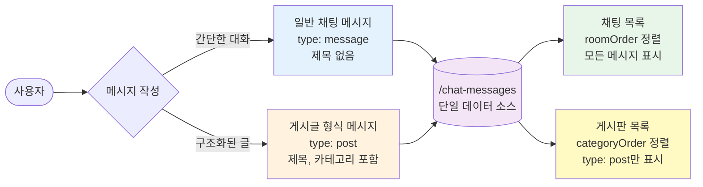
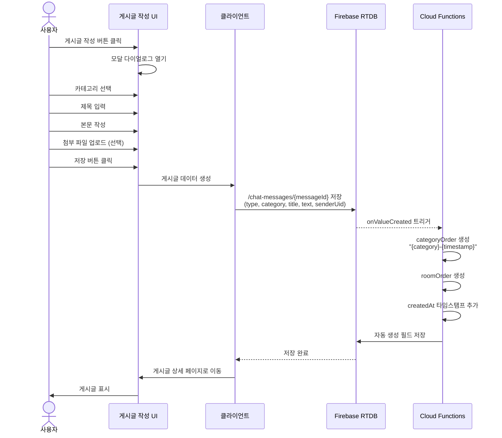

- [워크플로우](#워크플로우)
  - [📋 문서의 범위](#-문서의-범위)
  - [🎯 핵심 설계 개념](#-핵심-설계-개념)
  - [게시판과 채팅의 관계](#게시판과-채팅의-관계)
- [개요](#개요)
- [게시판 아키텍처](#게시판-아키텍처)
  - [통합 설계 원칙](#통합-설계-원칙)
  - [메시지 타입 기반 구분](#메시지-타입-기반-구분)
- [게시판 카테고리](#게시판-카테고리)
  - [카테고리 정의](#카테고리-정의)
  - [카테고리 확장](#카테고리-확장)
- [게시글 작성](#게시글-작성)
  - [작성 흐름](#작성-흐름)
  - [필수 필드](#필수-필드)
  - [Cloud Functions 자동 처리](#cloud-functions-자동-처리)
- [게시글 조회](#게시글-조회)
  - [카테고리별 조회](#카테고리별-조회)
  - [전체 게시글 조회](#전체-게시글-조회)
  - [특정 채팅방 게시글 조회](#특정-채팅방-게시글-조회)
- [게시글 데이터 구조](#게시글-데이터-구조)
  - [기본 필드](#기본-필드)
  - [Order 필드](#order-필드)
  - [자동 생성 필드](#자동-생성-필드)
- [게시판 UI 구조](#게시판-ui-구조)
  - [게시판 메인 페이지](#게시판-메인-페이지)
  - [카테고리 페이지](#카테고리-페이지)
  - [게시글 작성 페이지](#게시글-작성-페이지)
  - [게시글 상세 페이지](#게시글-상세-페이지)
- [게시판과 채팅의 차이점](#게시판과-채팅의-차이점)
  - [UI 표시 방식](#ui-표시-방식)
  - [조회 쿼리](#조회-쿼리)
  - [작성 방식](#작성-방식)
- [댓글 시스템](#댓글-시스템)
  - [댓글 구조](#댓글-구조)
  - [대댓글 (답글)](#대댓글-답글)
  - [댓글 정렬](#댓글-정렬)
- [좋아요 시스템](#좋아요-시스템)
  - [좋아요 데이터 구조](#좋아요-데이터-구조)
  - [좋아요 개수 관리](#좋아요-개수-관리)
- [신고 시스템](#신고-시스템)
  - [신고 사유](#신고-사유)
  - [신고 처리](#신고-처리)
- [게시판 통계](#게시판-통계)
  - [카테고리별 통계](#카테고리별-통계)
  - [전체 통계](#전체-통계)
- [구현 예시](#구현-예시)
  - [게시글 목록 컴포넌트](#게시글-목록-컴포넌트)
  - [게시글 작성 컴포넌트](#게시글-작성-컴포넌트)
- [향후 개발 항목](#향후-개발-항목)
- [관련 문서](#관련-문서)
- [작업 이력 (SED Log)](#작업-이력-sed-log)

---

## 워크플로우

### 📋 문서의 범위

본 문서는 **채팅 시스템과 통합된 게시판 기능의 아키텍처와 구현 방법**을 제공합니다.

- ✅ **포함되는 내용**:
  - 게시판과 채팅의 통합 구조
  - 게시판 카테고리 정의 및 확장 방법
  - 게시글 작성, 조회, 정렬 메커니즘
  - categoryOrder 필드 활용 전략
  - 게시판 UI 구조 및 컴포넌트
  - 댓글, 좋아요, 신고 시스템

- ❌ **포함되지 않는 내용**:
  - 채팅 메시지 시스템 상세 (별도 문서 참고)
  - Firebase 데이터베이스 보안 규칙 상세
  - Cloud Functions 구현 코드

**관련 문서:**
- [채팅 및 게시판 통합 시스템 개요](sonub-chat-overview.md) - 전체 아키텍처 이해
- [Firebase 데이터베이스 구조](sonub-firebase-database-structure.md) - 데이터 필드 상세
- [DatabaseListView 컴포넌트](sonub-firebase-database-list-view.md) - 목록 조회 구현

### 🎯 핵심 설계 개념

1. **게시판 = 채팅**: 게시판 기능이 채팅 시스템에 완전히 통합되어 있음
2. **메시지 타입 구분**: `type: "post"` 메시지가 게시글, `type: "message"`가 일반 채팅
3. **카테고리 기반 정렬**: `categoryOrder` 필드로 카테고리별 효율적 조회
4. **단일 데이터 소스**: 모든 메시지(채팅+게시글)가 `/chat-messages/{messageId}`에 저장
5. **조회 방식 차별화**: 동일한 데이터를 채팅 목록 또는 게시판 목록으로 다르게 표시

### 게시판과 채팅의 관계



---

## 개요

Sonub의 게시판 기능은 **채팅 시스템과 완전히 통합**되어 있습니다. 별도의 게시판 데이터베이스나 테이블이 존재하지 않으며, 모든 게시글은 채팅 메시지의 특수한 형태(`type: "post"`)로 저장됩니다.

**핵심 특징:**
- 📝 **채팅방 = 게시판**: 모든 채팅방에서 게시글 작성 가능
- 🏷️ **카테고리 기반 분류**: community, qna, news, market 등 카테고리로 게시글 구분
- 🔄 **실시간 동기화**: Firebase RTDB를 통한 실시간 게시글 업데이트
- 📊 **효율적 조회**: categoryOrder 필드로 카테고리별 빠른 정렬 및 페이지네이션
- 💬 **통합 댓글**: 게시글에 댓글 작성 시 채팅 메시지로 저장되어 실시간 반영

---

## 게시판 아키텍처

### 통합 설계 원칙

게시판은 채팅 시스템의 확장으로 설계되었으며, 다음 원칙을 따릅니다:

1. **단일 데이터 소스 (Single Source of Truth)**
   - 모든 메시지(채팅 + 게시글)는 `/chat-messages/{messageId}` 경로에 저장
   - 별도의 게시판 테이블 없음
   - 데이터 중복 최소화

2. **타입 기반 구분**
   - `type: "message"` → 일반 채팅 메시지
   - `type: "post"` → 게시글
   - 동일한 구조, 다른 표시 방식

3. **Order 필드 기반 정렬**
   - `roomOrder`: 채팅방별 메시지 정렬
   - `categoryOrder`: 게시판 카테고리별 정렬
   - Cloud Functions에서 자동 생성

4. **최소 정보 저장**
   - 클라이언트: 기본 정보만 저장 (title, category, text, senderUid)
   - Cloud Functions: 추가 메타데이터 자동 생성

### 메시지 타입 기반 구분

| 필드 | type: "message" | type: "post" |
|------|----------------|--------------|
| **text** | ✅ 필수 (메시지 내용) | ✅ 필수 (게시글 본문) |
| **title** | ❌ 없음 | ✅ 필수 (게시글 제목) |
| **category** | ❌ 없음 | ✅ 필수 (게시판 카테고리) |
| **categoryOrder** | ❌ 없음 | ✅ 자동 생성 |
| **roomOrder** | ✅ 자동 생성 | ✅ 자동 생성 |
| **표시 위치** | 채팅 목록 | 채팅 목록 + 게시판 목록 |

---

## 게시판 카테고리

### 카테고리 정의

게시판 카테고리는 `shared/categories.ts`에 상수로 정의되어 있으며, 클라이언트와 서버에서 공유됩니다:

```typescript
export const FORUM_CATEGORIES = [
  "discussion",
  "qna",
  "news",
  "info",
  "selling",
  "hiring",
  "travel",
  "mukbang",
  "realestate",
  "hobby",
] as const;
export type ForumCategory = (typeof FORUM_CATEGORIES)[number];
```

**카테고리 설명:**

| 카테고리 ID | 한글 이름 | 영문 이름 | 일본어 | 중국어 | 설명 |
|------------|---------|----------|-------|-------|------|
| `discussion` | 자유토론 | Free Discussion | 自由討論 | 自由讨论 | 자유로운 주제의 토론 게시판 |
| `qna` | 질문 | Q&A | 質問 | 提问 | 질문과 답변 게시판 |
| `news` | 뉴스 | News | ニュース | 新闻 | 뉴스 및 소식 |
| `info` | 정보 | Information | 情報 | 信息 | 유용한 정보 공유 |
| `selling` | 판매 | For Sale | 販売 | 销售 | 물품 판매 게시판 |
| `hiring` | 구인구직 | Jobs | 求人 | 招聘 | 구인/구직 정보 |
| `travel` | 여행 | Travel | 旅行 | 旅游 | 여행 정보 및 후기 |
| `mukbang` | 먹방 | Food & Dining | グルメ | 美食 | 음식 및 맛집 정보 |
| `realestate` | 부동산 | Real Estate | 不動産 | 房地产 | 부동산 정보 |
| `hobby` | 취미 | Hobbies | 趣味 | 兴趣爱好 | 취미 활동 공유 |

### 카테고리 확장

새로운 카테고리를 추가하려면:

1. **`shared/categories.ts` 파일 수정**:
   ```typescript
   export const FORUM_CATEGORIES = [
     "discussion",
     "qna",
     "news",
     "info",
     "selling",
     "hiring",
     "travel",
     "mukbang",
     "realestate",
     "hobby",
     "photo"  // 새 카테고리 추가
   ] as const;
   ```

2. **다국어 메시지 추가** (`messages/*.json`):
   ```json
   // messages/ko.json
   {
     "카테고리_photo": "사진"
   }

   // messages/en.json
   {
     "카테고리_photo": "Photo"
   }

   // messages/ja.json, zh.json도 동일하게 추가
   ```

3. **Cloud Functions 재배포**:
   ```bash
   cd firebase/functions
   npm run deploy
   ```

4. **UI에 카테고리 추가**:
   - 카테고리 드롭다운은 `FORUM_CATEGORIES` 배열을 자동으로 읽어 표시
   - 추가 UI 변경 불필요 (자동 반영됨)

---

## 게시글 작성

### 작성 흐름



### 필수 필드

클라이언트가 `/chat-messages/{messageId}`에 저장해야 하는 필수 필드:

```typescript
{
  type: "post",                    // 게시글 타입 (필수)
  category: "community",           // 카테고리 (필수)
  title: "게시글 제목",            // 제목 (필수)
  text: "게시글 본문 내용",        // 본문 (필수)
  senderUid: "작성자UID",          // 작성자 UID (필수)
  roomId: "채팅방ID",              // 게시글이 속한 채팅방 ID
  urls: ["https://..."],           // 첨부 파일 URL 배열 (선택)
}
```

**❌ 클라이언트가 저장하지 말아야 할 필드:**
- `categoryOrder` - Cloud Functions에서 자동 생성
- `roomOrder` - Cloud Functions에서 자동 생성
- `createdAt` - Cloud Functions에서 자동 생성
- `likeCount`, `commentCount` - Cloud Functions에서 자동 관리
- `senderName`, `senderPhotoUrl` - `/users/{senderUid}`에서 실시간 조회

### Cloud Functions 자동 처리

게시글 생성 시 Cloud Functions는 다음을 자동으로 처리합니다:

1. **categoryOrder 필드 생성**:
   ```typescript
   categoryOrder = `${category}-${timestamp}`;
   // 예: "discussion-1698473000000"
   ```

2. **allCategoryOrder 필드 생성**:
   ```typescript
   allCategoryOrder = timestamp;
   // 예: 1698473000000
   // 모든 카테고리의 게시글을 통합 조회할 때 사용
   ```

3. **type 필드 생성**:
   ```typescript
   type = "post";
   // 게시글 타입 표시 (일반 채팅 메시지와 구분)
   ```

4. **roomOrder 필드 생성**:
   ```typescript
   roomOrder = `-${roomId}-${timestamp}`;
   // 예: "-roomId123-1698473000000"
   ```

5. **타임스탬프 추가**:
   ```typescript
   createdAt = Date.now();
   ```

5. **카테고리 통계 업데이트** (향후 구현):
   ```typescript
   /forum-stats/{category}/postCount++
   ```

---

## 게시글 조회

### 카테고리별 조회

특정 카테고리의 게시글만 조회하려면 `categoryOrder` 필드를 사용합니다.

**DatabaseListView 컴포넌트 사용 예시:**

```svelte
<script lang="ts">
  import DatabaseListView from '$lib/components/DatabaseListView.svelte';

  const category = 'community';  // 조회할 카테고리
  const categoryPrefix = `${category}-`;  // "community-"
</script>

<DatabaseListView
  path="chat-messages"
  orderBy="categoryOrder"
  orderPrefix={categoryPrefix}
  reverse={true}
  pageSize={20}
>
  {#snippet item(itemData)}
    {@const post = itemData.data}
    <article>
      <h2>{post.title}</h2>
      <p>{post.text}</p>
    </article>
  {/snippet}
</DatabaseListView>
```

**쿼리 동작:**
1. `categoryOrder` 필드로 정렬
2. `orderPrefix`로 시작하는 항목만 필터링 (`"community-"`)
3. `reverse: true`로 최신 게시글 먼저 표시
4. 페이지네이션 자동 처리 (무한 스크롤)

### 전체 게시글 조회

모든 카테고리의 게시글을 조회하려면 `allCategoryOrder` 필드를 사용합니다:

```svelte
<DatabaseListView
  path="chat-messages"
  orderBy="allCategoryOrder"
  reverse={true}
  pageSize={20}
>
  <!-- ... -->
</DatabaseListView>
```

**참고:**
- `allCategoryOrder` 필드는 timestamp 값으로 모든 카테고리 게시글을 시간순으로 정렬합니다
- 카테고리가 지정된 메시지만 `allCategoryOrder` 필드를 가지므로, 자동으로 카테고리 글만 조회됩니다
- `categoryOrder`와 달리 prefix 없이 모든 카테고리를 포함합니다

### 특정 채팅방 게시글 조회

특정 채팅방의 게시글만 조회하려면 `roomOrder` 필드를 사용합니다:

```svelte
<script lang="ts">
  const roomId = 'roomId123';
  const roomPrefix = `-${roomId}-`;
</script>

<DatabaseListView
  path="chat-messages"
  orderBy="roomOrder"
  orderPrefix={roomPrefix}
  reverse={true}
>
  {#snippet item(itemData)}
    {@const message = itemData.data}
    {#if message.type === 'post'}
      <!-- 게시글 표시 -->
      <article>
        <h2>{message.title}</h2>
        <p>{message.text}</p>
      </article>
    {:else}
      <!-- 일반 메시지 표시 -->
      <p>{message.text}</p>
    {/if}
  {/snippet}
</DatabaseListView>
```

---

## 게시글 데이터 구조

### 기본 필드

게시글은 채팅 메시지와 동일한 구조를 공유하며, 추가 필드를 포함합니다:

```typescript
interface PostMessage {
  // 기본 메시지 필드
  messageId: string;              // 고유 메시지 ID (자동 생성)
  type: "post";                   // 게시글 타입
  senderUid: string;              // 작성자 UID
  text: string;                   // 게시글 본문
  urls?: string[];                // 첨부 파일 URL 배열
  createdAt: number;              // 작성 시간 (Unix timestamp)
  editedAt?: number;              // 수정 시간 (수정된 경우만)
  deletedAt?: number;             // 삭제 시간 (삭제된 경우만)

  // 게시글 전용 필드
  category: string;               // 카테고리 (community, qna, news, market)
  title: string;                  // 게시글 제목
  roomId?: string;                // 게시글이 속한 채팅방 ID

  // Order 필드 (Cloud Functions에서 자동 생성)
  categoryOrder: string;          // "{category}-{timestamp}"
  roomOrder: string;              // "-{roomId}-{timestamp}"
  rootOrder?: string;             // "-{parentRoomId}-{timestamp}" (서브 채팅방용)

  // 통계 필드 (Cloud Functions에서 자동 관리)
  likeCount?: number;             // 좋아요 수
  commentCount?: number;          // 댓글 수
  reportCount?: number;           // 신고 수
}
```

### Order 필드

게시판 조회를 위한 핵심 필드는 `categoryOrder`입니다:

**형식:**
```typescript
categoryOrder = `${category}-${timestamp}`;
```

**예시:**
```typescript
{
  category: "community",
  createdAt: 1698473000000,
  categoryOrder: "community-1698473000000"
}
```

**장점:**
1. **카테고리별 필터링**: prefix 쿼리로 특정 카테고리만 조회
2. **시간 순 정렬**: timestamp 부분으로 최신순/오래된순 정렬
3. **효율적 페이지네이션**: Firebase RTDB의 범위 쿼리 활용

### 자동 생성 필드

Cloud Functions가 자동으로 생성/관리하는 필드:

| 필드 | 생성 시점 | 업데이트 시점 | 설명 |
|------|----------|-------------|------|
| `categoryOrder` | 게시글 생성 | - | 카테고리별 정렬 키 (`{category}-{timestamp}`) |
| `allCategoryOrder` | 게시글 생성 | - | 모든 카테고리 통합 정렬 키 (timestamp) |
| `type` | 게시글 생성 | - | 게시글 타입 ("post") |
| `roomOrder` | 게시글 생성 | - | 채팅방별 정렬 키 |
| `createdAt` | 게시글 생성 | - | 작성 시간 |
| `likeCount` | 첫 좋아요 시 | 좋아요 추가/제거 | 좋아요 개수 |
| `commentCount` | 첫 댓글 작성 시 | 댓글 추가/삭제 | 댓글 개수 |
| `reportCount` | 첫 신고 시 | 신고 추가 | 신고 개수 |

---

## 게시판 UI 구조

### 게시판 메인 페이지

**경로:** `/forum` (향후 구현)

**구성 요소:**
- 카테고리 탭 메뉴
- 최신 게시글 목록
- 카테고리별 통계 (게시글 수, 댓글 수)

**UI 레이아웃:**
```
┌─────────────────────────────────────────┐
│ 게시판                                   │
├─────────────────────────────────────────┤
│ [커뮤니티] [질문답변] [뉴스] [회원장터]  │
├─────────────────────────────────────────┤
│ 📝 최신 게시글 제목 1                    │
│    작성자 · 2시간 전 · 댓글 5 · 좋아요 12 │
├─────────────────────────────────────────┤
│ 📝 최신 게시글 제목 2                    │
│    작성자 · 5시간 전 · 댓글 3 · 좋아요 7  │
└─────────────────────────────────────────┘
```

### 카테고리 페이지

**경로:** `/post/list` ✅ **구현 완료**

**구성 요소:**
- 카테고리 탭 (Chip 형태) - 전체 + 10개 카테고리
- 게시글 목록 (무한 스크롤, DatabaseListView 사용)
- 카테고리 선택 시 동적 필터링

**구현 세부사항:**
- **전체 목록**: `orderBy="allCategoryOrder"`, `orderPrefix=""`, `reverse={true}`
- **카테고리별 목록**: `orderBy="categoryOrder"`, `orderPrefix="{category}-"`, `reverse={true}`
- **상태 관리**: `let selectedCategory = $state<ForumCategory | null>(null)`
- **UI**: Tailwind CSS chip 컴포넌트 (active 상태 표시)
- **라우팅**: 게시글 클릭 시 `/chat/room?roomId={roomId}`로 이동

**실제 구현 코드:**
```svelte
<!-- 파일: src/routes/post/list/+page.svelte -->
<script lang="ts">
  import { FORUM_CATEGORIES, type ForumCategory } from '../../../../shared/categories';
  import DatabaseListView from '$lib/components/DatabaseListView.svelte';
  import * as m from '$lib/paraglide/messages.js';

  let selectedCategory = $state<ForumCategory | null>(null);

  const orderByField = $derived(selectedCategory ? 'categoryOrder' : 'allCategoryOrder');
  const orderPrefixValue = $derived(selectedCategory ? `${selectedCategory}-` : '');
</script>

<!-- 카테고리 탭 -->
<div class="category-tabs">
  <button class:active={selectedCategory === null} onclick={() => selectedCategory = null}>
    전체
  </button>
  {#each FORUM_CATEGORIES as category}
    <button class:active={selectedCategory === category} onclick={() => selectedCategory = category}>
      {getCategoryMessage(category)}
    </button>
  {/each}
</div>

<!-- 게시글 목록 -->
<DatabaseListView
  path="chat-messages"
  orderBy={orderByField}
  orderPrefix={orderPrefixValue}
  reverse={true}
  pageSize={20}
>
  {#snippet item(itemData)}
    {@const message = itemData.data}
    <div class="post-card" onclick={() => handleMessageClick(message.roomId)}>
      <!-- 카테고리 뱃지, 메시지 내용, 메타 정보 -->
    </div>
  {/snippet}
</DatabaseListView>
```

**개발 과정:**
1. **카테고리 상수 사용**: `shared/categories.ts`의 `FORUM_CATEGORIES` 배열 활용
2. **동적 쿼리**: 선택된 카테고리에 따라 `orderBy`와 `orderPrefix` 자동 변경
3. **DatabaseListView**: `orderPrefix` prop을 통해 `startAt(prefix)`, `endAt(prefix + '\uf8ff')` 자동 처리
4. **역순 정렬**: `reverse={true}`로 최신 게시글 먼저 표시

**로직:**
- **전체 보기**: 사용자가 "전체" 탭 클릭 → `selectedCategory = null` → `allCategoryOrder` 기준 정렬 → 모든 카테고리 게시글 표시
- **카테고리 필터링**: 사용자가 특정 카테고리 탭 클릭 (예: "질문") → `selectedCategory = "qna"` → `categoryOrder` 필드에서 `orderPrefix="qna-"`로 필터링 → "qna" 카테고리 게시글만 표시

**결과:**
- ✅ 카테고리별 게시글 목록 페이지 구현 완료
- ✅ 무한 스크롤 기능 정상 작동
- ✅ 전체/카테고리별 필터링 정상 작동
- ✅ Tailwind CSS 스타일링 적용 (chip, card, hover 효과)

### 게시글 작성 페이지

**방식:** 모달 다이얼로그 (별도 페이지 아님)

**컴포넌트:** `PostCreateDialog.svelte` ✅ **구현 완료**

**구성 요소:**
- **카테고리 선택** (드롭다운) - `FORUM_CATEGORIES` 배열 기반
- **채팅방 선택** (드롭다운) - `/chat-joins/{uid}`의 `openAndGroupListOrder` 필드가 있는 그룹/오픈 채팅방만 표시, 기본값: "post"
- **글 내용** (텍스트 에리어) - 본문 작성
- **사진 업로드** (다중 파일) - Firebase Storage 업로드, 진행률 표시
- **저장/취소** 버튼

**구현 세부사항:**

1. **채팅방 선택 로직:**
   - `loadChatRooms()` 함수: `/chat-joins/{uid}` 경로에서 `orderByChild('openAndGroupListOrder')` 쿼리
   - `openAndGroupListOrder` 필드가 있는 노드만 필터링
   - `roomName` 표시, `roomId` 값 저장
   - 선택하지 않으면 기본값 "post" 사용

2. **파일 업로드:**
   - `handleFiles()` 함수: 파일 선택 즉시 Firebase Storage에 업로드 시작
   - `uploadChatFile()` 사용 - roomId는 "post" 고정
   - 업로드 진행률 실시간 표시 (`FileUploadStatus` 인터페이스)
   - 업로드 완료된 파일만 메시지 payload의 `urls` 객체에 포함
   - 취소 시 `deleteChatFile()`로 Storage에서 파일 삭제

3. **메시지 저장:**
   - `pushData('chat-messages', payload)` 호출
   - Payload 구조:
     ```typescript
     {
       roomId: selectedRoomId,        // 선택한 채팅방 ID 또는 "post"
       type: 'message',               // 클라이언트는 "message"로 저장
       text: postText.trim(),
       urls: { 0: "url1", 1: "url2" },
       senderUid: authStore.user.uid,
       createdAt: timestamp,
       editedAt: null,
       deletedAt: null,
       category: selectedCategory,    // 카테고리 필드 포함
       roomOrder: `-${selectedRoomId}-${timestamp}`,
       rootOrder: `-${selectedRoomId}-${timestamp}`
     }
     ```
   - Cloud Functions가 `category` 필드를 감지하여 `categoryOrder`, `allCategoryOrder`, `type: "post"` 자동 생성

4. **카테고리 자동 선택:**
   - `onPostCreated` 콜백으로 부모 컴포넌트에 선택된 카테고리 전달
   - 게시판 페이지에서 `handlePostCreated(category)` 실행 → `selectedCategory` 업데이트
   - 사용자가 글 작성 후 해당 카테고리 게시글 목록에서 자동으로 확인 가능

**사용 예시:**
```svelte
<!-- 파일: src/routes/post/list/+page.svelte -->
<script lang="ts">
  import { Button } from '$lib/components/ui/button';
  import PostCreateDialog from '$lib/components/post/PostCreateDialog.svelte';

  let isCreateDialogOpen = $state(false);
  let selectedCategory = $state<ForumCategory | null>(null);

  function handlePostCreated(category: ForumCategory) {
    selectedCategory = category;  // 작성한 게시글의 카테고리로 자동 이동
  }
</script>

<div class="post-list-header">
  <h1 class="post-list-title">{m.chatCategoryLabel()}</h1>
  <Button onclick={() => (isCreateDialogOpen = true)}>글쓰기</Button>
</div>

<PostCreateDialog
  bind:open={isCreateDialogOpen}
  onPostCreated={handlePostCreated}
/>
```

**개발 과정:**
1. ✅ 기존 채팅 메시지 전송 로직 분석 (`/routes/chat/room/+page.svelte`)
2. ✅ 파일 업로드 함수 재사용 (`uploadChatFile`, `deleteChatFile`)
3. ✅ `PostCreateDialog.svelte` 컴포넌트 생성 (Svelte 5 runes, shadcn-ui Dialog)
4. ✅ `/post/list` 페이지에 "글쓰기" 버튼 통합
5. ✅ TypeScript 타입 에러 수정 (native HTML select 사용)
6. ✅ 코드 검사 및 테스트 완료 (0 errors)

**결과:**
- ✅ 게시판 페이지에서 "글쓰기" 버튼 클릭 시 모달 다이얼로그 표시
- ✅ 카테고리, 채팅방, 내용, 사진 입력 후 저장 가능
- ✅ 저장된 게시글은 `/chat-messages`에 메시지로 저장
- ✅ Cloud Functions가 자동으로 `categoryOrder`, `type` 필드 생성
- ✅ 작성 후 해당 카테고리로 자동 이동

### 게시글 상세 페이지

**경로:** `/forum/post/[messageId]` (향후 구현)

**구성 요소:**
- 게시글 제목, 본문, 작성자 정보
- 좋아요 버튼
- 댓글 목록
- 댓글 작성 폼
- 신고 버튼

**UI 레이아웃:**
```
┌─────────────────────────────────────────┐
│ 게시글 제목                              │
│ 작성자 · 2시간 전 · [좋아요 12] [신고]   │
├─────────────────────────────────────────┤
│ 게시글 본문 내용...                      │
│                                         │
│ [첨부 이미지]                            │
├─────────────────────────────────────────┤
│ 💬 댓글 5개                              │
├─────────────────────────────────────────┤
│ 👤 사용자1 · 1시간 전                    │
│    댓글 내용...                          │
│    [좋아요 3] [답글]                     │
├─────────────────────────────────────────┤
│ [댓글 작성 폼]                           │
└─────────────────────────────────────────┘
```

---

## 게시판과 채팅의 차이점

### UI 표시 방식

| 요소 | 채팅 목록 | 게시판 목록 |
|------|----------|-----------|
| **표시 메시지** | 모든 메시지 (`type: "message"` + `type: "post"`) | `type: "post"`만 |
| **정렬 필드** | `roomOrder` | `categoryOrder` |
| **제목 표시** | 없음 (메시지 본문만) | 있음 (`title` 필드) |
| **카테고리** | 표시 안 함 | 카테고리 뱃지 표시 |
| **작성 방식** | 간단한 입력창 | 모달 다이얼로그 (제목, 카테고리 선택) |

### 조회 쿼리

**채팅 목록 조회:**
```typescript
// roomOrder 필드로 정렬
const query = rtdbQuery(
  rtdbRef(rtdb, 'chat-messages'),
  rtdbOrderByChild('roomOrder'),
  rtdbStartAt(`-${roomId}-`),
  rtdbEndAt(`-${roomId}-\uf8ff`)
);
```

**게시판 목록 조회:**
```typescript
// categoryOrder 필드로 정렬
const query = rtdbQuery(
  rtdbRef(rtdb, 'chat-messages'),
  rtdbOrderByChild('categoryOrder'),
  rtdbStartAt(`${category}-`),
  rtdbEndAt(`${category}-\uf8ff`)
);
```

### 작성 방식

**일반 채팅 메시지:**
- 간단한 텍스트 입력창
- Enter 키로 즉시 전송
- 제목 없음
- 카테고리 선택 없음

**게시글:**
- 모달 다이얼로그 열기
- 카테고리 선택 필수
- 제목 입력 필수
- 본문 작성
- 저장 버튼 클릭

---

## 댓글 시스템

### 댓글 구조

댓글도 채팅 메시지와 동일한 구조를 사용합니다:

```typescript
{
  type: "message",              // 댓글은 일반 메시지 타입
  text: "댓글 내용",
  senderUid: "작성자UID",
  parentId: "게시글messageId",  // 부모 게시글 ID
  roomId: "채팅방ID",
  depth: 1,                     // 댓글 깊이 (1: 댓글, 2: 대댓글, ...)
  createdAt: 1698473000000
}
```

### 대댓글 (답글)

대댓글은 `parentId`와 `depth` 필드로 계층 구조를 표현합니다:

```typescript
{
  type: "message",
  text: "대댓글 내용",
  senderUid: "작성자UID",
  parentId: "댓글messageId",    // 부모 댓글 ID
  depth: 2,                     // 대댓글 깊이
  createdAt: 1698473100000
}
```

**최대 깊이:** 12단계 (설정 가능)

### 댓글 정렬

댓글은 `createdAt` 필드로 시간순 정렬됩니다:

```typescript
// 특정 게시글의 댓글 조회
const query = rtdbQuery(
  rtdbRef(rtdb, 'chat-messages'),
  rtdbOrderByChild('parentId'),
  rtdbEqualTo(postMessageId)
);
```

---

## 좋아요 시스템

### 좋아요 데이터 구조

좋아요는 `/likes/{likeId}` 경로에 저장됩니다:

```typescript
{
  likeId: "post-{messageId}-{uid}",  // 고유 좋아요 ID
  type: "post",                       // 좋아요 대상 타입
  nodeId: "messageId",                // 게시글 ID
  uid: "사용자UID",                   // 좋아요한 사용자
  createdAt: 1698473000000           // 좋아요 시간
}
```

### 좋아요 개수 관리

Cloud Functions가 좋아요 개수를 자동으로 관리합니다:

1. **좋아요 추가 시:**
   ```typescript
   /likes/post-{messageId}-{uid} = { ... }
   // Cloud Functions 트리거
   /chat-messages/{messageId}/likeCount++
   ```

2. **좋아요 취소 시:**
   ```typescript
   /likes/post-{messageId}-{uid} 삭제
   // Cloud Functions 트리거
   /chat-messages/{messageId}/likeCount--
   ```

---

## 신고 시스템

### 신고 사유

신고 사유는 다음과 같이 정의되어 있습니다:

```typescript
export type ReportReason =
  | "abuse"         // 욕설, 시비, 모욕, 명예훼손
  | "fake-news"     // 가짜 뉴스, 잘못된 정보
  | "spam"          // 스팸, 악용
  | "inappropriate" // 카테고리에 맞지 않는 글
  | "other";        // 기타
```

### 신고 처리

신고는 `/reports/{reportId}` 경로에 저장됩니다:

```typescript
{
  reportId: "post-{messageId}-{uid}",  // 고유 신고 ID
  type: "post",                        // 신고 대상 타입
  nodeId: "messageId",                 // 게시글 ID
  uid: "신고자UID",                    // 신고한 사용자
  reason: "spam",                      // 신고 사유
  message: "상세 설명",                // 신고 내용 (선택)
  createdAt: 1698473000000            // 신고 시간
}
```

Cloud Functions가 신고 개수를 자동으로 업데이트:

```typescript
/reports/post-{messageId}-{uid} 생성
// Cloud Functions 트리거
/chat-messages/{messageId}/reportCount++
```

---

## 게시판 통계

### 카테고리별 통계

각 카테고리의 통계는 `/forum-stats/{category}` 경로에 저장됩니다 (향후 구현):

```typescript
{
  postCount: 150,       // 총 게시글 수
  commentCount: 450,    // 총 댓글 수
  todayPostCount: 12,   // 오늘 작성된 게시글 수
  weekPostCount: 78,    // 이번 주 작성된 게시글 수
}
```

### 전체 통계

전체 게시판 통계는 `/forum-stats/all` 경로에 저장됩니다 (향후 구현):

```typescript
{
  totalPosts: 500,
  totalComments: 1500,
  totalUsers: 200,
  categories: {
    community: 150,
    qna: 180,
    news: 90,
    market: 80
  }
}
```

---

## 구현 예시

### 게시글 목록 컴포넌트

```svelte
<!-- 파일: src/lib/components/forum/ForumPostList.svelte -->
<script lang="ts">
  import DatabaseListView from '$lib/components/DatabaseListView.svelte';
  import { goto } from '$app/navigation';
  import { formatLongDate } from '$lib/functions/date.functions';

  interface Props {
    category: string;  // 조회할 카테고리
  }

  let { category }: Props = $props();

  const categoryPrefix = $derived(`${category}-`);

  function openPost(messageId: string) {
    goto(`/forum/post/${messageId}`);
  }
</script>

<DatabaseListView
  path="chat-messages"
  orderBy="categoryOrder"
  orderPrefix={categoryPrefix}
  reverse={true}
  pageSize={20}
>
  {#snippet item(itemData)}
    {@const post = itemData.data}
    {@const messageId = itemData.key}

    <article class="post-item" onclick={() => openPost(messageId)}>
      <div class="post-header">
        <h2 class="post-title">{post.title}</h2>
        <span class="post-category">{post.category}</span>
      </div>

      <p class="post-preview">
        {post.text.substring(0, 150)}...
      </p>

      <div class="post-meta">
        <span class="author">{post.senderName ?? '익명'}</span>
        <span class="date">{formatLongDate(post.createdAt)}</span>
        <span class="stats">
          💬 {post.commentCount ?? 0}
          · ❤️ {post.likeCount ?? 0}
        </span>
      </div>
    </article>
  {/snippet}

  {#snippet loading()}
    <p class="loading">게시글을 불러오는 중...</p>
  {/snippet}

  {#snippet empty()}
    <p class="empty">아직 게시글이 없습니다.</p>
  {/snippet}
</DatabaseListView>

<style>
  .post-item {
    @apply cursor-pointer rounded-lg border border-gray-200 bg-white p-4 shadow-sm transition hover:shadow-md;
  }

  .post-header {
    @apply mb-2 flex items-center justify-between;
  }

  .post-title {
    @apply text-lg font-semibold text-gray-900;
  }

  .post-category {
    @apply rounded-full bg-blue-100 px-3 py-1 text-xs font-semibold uppercase text-blue-600;
  }

  .post-preview {
    @apply mb-3 text-sm text-gray-600 line-clamp-2;
  }

  .post-meta {
    @apply flex items-center gap-2 text-xs text-gray-500;
  }
</style>
```

### 게시글 작성 컴포넌트

**✅ 실제 구현된 코드** (2025-11-16)

```svelte
<!-- 파일: src/lib/components/post/PostCreateDialog.svelte -->
<script lang="ts">
  import { Dialog, DialogContent, DialogHeader, DialogTitle } from '$lib/components/ui/dialog';
  import { Button } from '$lib/components/ui/button';
  import { FORUM_CATEGORIES, type ForumCategory } from '../../../../shared/categories';
  import * as m from '$lib/paraglide/messages.js';
  import { authStore } from '$lib/stores/auth.svelte';
  import { pushData } from '$lib/stores/database.svelte';
  import { uploadChatFile, deleteChatFile, formatFileSize } from '$lib/functions/storage.functions';
  import type { FileUploadStatus } from '$lib/types/chat.types';
  import { rtdb } from '$lib/firebase';
  import { ref, query, orderByChild, get } from 'firebase/database';

  // Props 인터페이스
  interface Props {
    open: boolean;
    onPostCreated?: (category: ForumCategory) => void;
  }

  let { open = $bindable(), onPostCreated }: Props = $props();

  // 카테고리 i18n 매핑
  const getCategoryMessage = (category: ForumCategory) => {
    const categoryMap: Record<ForumCategory, () => string> = {
      discussion: m.chatCategoryFreeDiscussion,
      qna: m.chatCategoryQna,
      news: m.chatCategoryNews,
      info: m.chatCategoryInformation,
      selling: m.chatCategoryForSale,
      hiring: m.chatCategoryJobs,
      travel: m.chatCategoryTravel,
      mukbang: m.chatCategoryFood,
      realestate: m.chatCategoryRealEstate,
      hobby: m.chatCategoryHobby
    };
    return categoryMap[category]();
  };

  // 상태 관리
  let postText = $state('');
  let selectedCategory = $state<string>('');
  let selectedRoomId = $state<string>('post');
  let uploadingFiles: FileUploadStatus[] = $state([]);
  let isSaving = $state(false);
  let saveError = $state<string | null>(null);
  let fileInputRef: HTMLInputElement | null = $state(null);

  // 그룹/오픈 채팅방 목록
  let chatRooms: Array<{ roomId: string; roomName: string }> = $state([]);
  let loadingRooms = $state(false);

  /**
   * 그룹/오픈 채팅방 목록 로드
   * /chat-joins/{uid}에서 openAndGroupListOrder가 있는 노드만 가져오기
   */
  async function loadChatRooms() {
    if (!authStore.user?.uid || !rtdb) {
      chatRooms = [];
      return;
    }

    loadingRooms = true;

    try {
      const joinsRef = ref(rtdb, `chat-joins/${authStore.user.uid}`);
      const joinsQuery = query(joinsRef, orderByChild('openAndGroupListOrder'));
      const snapshot = await get(joinsQuery);

      const rooms: Array<{ roomId: string; roomName: string }> = [];

      snapshot.forEach((child) => {
        const value = child.val();
        if (value?.openAndGroupListOrder) {
          rooms.push({
            roomId: child.key ?? '',
            roomName: (value.roomName as string) || child.key || '이름 없는 채팅방'
          });
        }
      });

      chatRooms = rooms;
    } catch (error) {
      console.error('채팅방 목록 로드 실패:', error);
      chatRooms = [];
    } finally {
      loadingRooms = false;
    }
  }

  // 다이얼로그 열릴 때 채팅방 목록 로드
  $effect(() => {
    if (open) {
      loadChatRooms();
    }
  });

  /**
   * 파일 선택 핸들러
   */
  function handleFileSelect(event: Event) {
    const input = event.target as HTMLInputElement;
    const files = input.files;
    if (!files || files.length === 0) return;

    handleFiles(Array.from(files));
    input.value = '';  // input 값 초기화
  }

  /**
   * 파일 업로드 처리
   */
  async function handleFiles(files: File[]) {
    if (!authStore.user?.uid) {
      saveError = '로그인이 필요합니다.';
      return;
    }

    for (const file of files) {
      const fileStatus: FileUploadStatus = {
        file,
        progress: 0,
        downloadUrl: undefined,
        error: undefined,
        completed: false
      };

      uploadingFiles = [...uploadingFiles, fileStatus];
      const currentIndex = uploadingFiles.length - 1;

      try {
        const downloadUrl = await uploadChatFile(
          file,
          authStore.user.uid,
          'post',  // roomId로 "post" 사용
          (progress) => {
            uploadingFiles[currentIndex].progress = progress;
          }
        );

        uploadingFiles[currentIndex].completed = true;
        uploadingFiles[currentIndex].downloadUrl = downloadUrl;
      } catch (error) {
        console.error('파일 업로드 실패:', error);
        uploadingFiles[currentIndex].error = '업로드 실패';
      }
    }
  }

  /**
   * 파일 삭제 핸들러
   */
  async function handleRemoveFile(index: number) {
    const fileStatus = uploadingFiles[index];

    if (fileStatus.downloadUrl) {
      try {
        await deleteChatFile(fileStatus.downloadUrl);
      } catch (error) {
        console.error('파일 삭제 실패:', error);
      }
    }

    uploadingFiles = uploadingFiles.filter((_, i) => i !== index);
  }

  /**
   * 게시글 저장 핸들러
   */
  async function handleSave() {
    if (isSaving) return;
    if (!postText.trim() && uploadingFiles.length === 0) {
      saveError = '내용을 입력하거나 사진을 첨부해주세요.';
      return;
    }
    if (!selectedCategory) {
      saveError = '카테고리를 선택해주세요.';
      return;
    }
    if (!authStore.user?.uid) {
      saveError = '로그인이 필요합니다.';
      return;
    }

    isSaving = true;
    saveError = null;

    try {
      // 업로드 완료되지 않은 파일 확인
      const incompleteFiles = uploadingFiles.filter((fs) => !fs.completed && !fs.error);
      if (incompleteFiles.length > 0) {
        saveError = `업로드 중인 파일이 ${incompleteFiles.length}개 있습니다.`;
        isSaving = false;
        return;
      }

      // 파일 URL 수집
      let urls: Record<number, string> = {};
      uploadingFiles.forEach((fs, index) => {
        if (fs.downloadUrl) {
          urls[index] = fs.downloadUrl;
        }
      });

      // 메시지 payload 생성
      const timestamp = Date.now();
      const payload: Record<string, any> = {
        roomId: selectedRoomId,
        type: 'message',  // 클라이언트는 "message"로 저장, Cloud Functions가 "post"로 변경
        text: postText.trim(),
        urls,
        senderUid: authStore.user.uid,
        createdAt: timestamp,
        editedAt: null,
        deletedAt: null,
        category: selectedCategory,  // 카테고리 필드 포함
        roomOrder: `-${selectedRoomId}-${timestamp}`,
        rootOrder: `-${selectedRoomId}-${timestamp}`
      };

      // /chat-messages에 메시지 저장
      const result = await pushData('chat-messages', payload);

      if (!result.success) {
        saveError = result.error ?? '저장에 실패했습니다.';
        isSaving = false;
        return;
      }

      // 성공 시 초기화 및 모달 닫기
      postText = '';
      uploadingFiles = [];
      selectedRoomId = 'post';
      isSaving = false;

      // 게시판 페이지에서 카테고리 자동 선택을 위한 콜백 호출
      const createdCategory = selectedCategory as ForumCategory;
      if (onPostCreated) {
        onPostCreated(createdCategory);
      }

      selectedCategory = '';
      open = false;
    } catch (error) {
      console.error('게시글 저장 실패:', error);
      saveError = '게시글 저장에 실패했습니다.';
      isSaving = false;
    }
  }

  /**
   * 취소 핸들러
   */
  function handleCancel() {
    // 업로드된 파일 삭제
    uploadingFiles.forEach(async (fileStatus) => {
      if (fileStatus.downloadUrl) {
        try {
          await deleteChatFile(fileStatus.downloadUrl);
        } catch (error) {
          console.error('파일 삭제 실패:', error);
        }
      }
    });

    // 상태 초기화
    postText = '';
    selectedCategory = '';
    selectedRoomId = 'post';
    uploadingFiles = [];
    saveError = null;

    open = false;
  }
</script>

<Dialog bind:open>
  <DialogContent class="max-w-2xl">
    <DialogHeader>
      <DialogTitle>게시글 작성</DialogTitle>
    </DialogHeader>

    <div class="post-create-form">
      <!-- 카테고리 선택 -->
      <div class="form-group">
        <label for="category" class="form-label">카테고리 *</label>
        <select id="category" bind:value={selectedCategory} class="form-select">
          <option value="">{m.chatCategorySelect()}</option>
          {#each FORUM_CATEGORIES as category}
            <option value={category}>{getCategoryMessage(category)}</option>
          {/each}
        </select>
      </div>

      <!-- 채팅방 선택 -->
      <div class="form-group">
        <label for="roomId" class="form-label">채팅방</label>
        <select id="roomId" bind:value={selectedRoomId} class="form-select">
          <option value="post">기본</option>
          {#if loadingRooms}
            <option value="" disabled>로딩 중...</option>
          {:else}
            {#each chatRooms as room}
              <option value={room.roomId}>{room.roomName}</option>
            {/each}
          {/if}
        </select>
      </div>

      <!-- 글 내용 -->
      <div class="form-group">
        <label for="postText" class="form-label">내용</label>
        <textarea
          id="postText"
          bind:value={postText}
          placeholder="내용을 입력하세요"
          class="post-textarea"
          rows="6"
        ></textarea>
      </div>

      <!-- 사진 업로드 -->
      <div class="form-group">
        <label class="form-label">사진</label>
        <input
          type="file"
          bind:this={fileInputRef}
          onchange={handleFileSelect}
          accept="image/*"
          multiple
          class="hidden"
        />
        <Button type="button" variant="outline" onclick={() => fileInputRef?.click()}>
          사진 선택
        </Button>

        <!-- 업로드된 파일 목록 -->
        {#if uploadingFiles.length > 0}
          <div class="uploaded-files">
            {#each uploadingFiles as fileStatus, index}
              <div class="file-item">
                <div class="file-info">
                  <div class="file-name">{fileStatus.file.name}</div>
                  <div class="file-size">{formatFileSize(fileStatus.file.size)}</div>
                  {#if !fileStatus.completed && !fileStatus.error}
                    <div class="file-progress">
                      <div class="progress-bar">
                        <div class="progress-fill" style="width: {fileStatus.progress}%"></div>
                      </div>
                      <span class="progress-text">{Math.round(fileStatus.progress)}%</span>
                    </div>
                  {/if}
                  {#if fileStatus.error}
                    <div class="file-error">{fileStatus.error}</div>
                  {/if}
                </div>
                <Button
                  type="button"
                  variant="ghost"
                  size="sm"
                  onclick={() => handleRemoveFile(index)}
                >
                  삭제
                </Button>
              </div>
            {/each}
          </div>
        {/if}
      </div>

      <!-- 에러 메시지 -->
      {#if saveError}
        <div class="error-message">{saveError}</div>
      {/if}

      <!-- 액션 버튼 -->
      <div class="form-actions">
        <Button type="button" variant="outline" onclick={handleCancel} disabled={isSaving}>
          취소
        </Button>
        <Button type="button" onclick={handleSave} disabled={isSaving}>
          {isSaving ? '저장 중...' : '저장'}
        </Button>
      </div>
    </div>
  </DialogContent>
</Dialog>

<style>
  @import 'tailwindcss' reference;

  .post-create-form {
    @apply flex flex-col gap-4;
  }

  .form-group {
    @apply flex flex-col gap-2;
  }

  .form-label {
    @apply text-sm font-medium text-gray-700;
  }

  .form-select {
    @apply w-full rounded-md border border-gray-300 px-3 py-2 text-sm;
    @apply focus:border-blue-600 focus:outline-none focus:ring-1 focus:ring-blue-600;
  }

  .post-textarea {
    @apply w-full rounded-md border border-gray-300 px-3 py-2 text-sm;
    @apply focus:border-blue-600 focus:outline-none focus:ring-1 focus:ring-blue-600;
  }

  .uploaded-files {
    @apply mt-2 flex flex-col gap-2;
  }

  .file-item {
    @apply flex items-center justify-between rounded-md border border-gray-200 bg-gray-50 p-2;
  }

  .file-info {
    @apply flex flex-col gap-1;
  }

  .file-name {
    @apply text-sm font-medium text-gray-900;
  }

  .file-size {
    @apply text-xs text-gray-500;
  }

  .file-progress {
    @apply flex items-center gap-2;
  }

  .progress-bar {
    @apply h-2 w-32 overflow-hidden rounded-full bg-gray-200;
  }

  .progress-fill {
    @apply h-full bg-blue-600 transition-all;
  }

  .progress-text {
    @apply text-xs text-gray-600;
  }

  .file-error {
    @apply text-xs text-red-600;
  }

  .error-message {
    @apply rounded-md bg-red-50 p-3 text-sm text-red-600;
  }

  .form-actions {
    @apply flex justify-end gap-2;
  }
</style>
```

**핵심 기능:**
1. **채팅 통합**: 채팅 메시지 구조 재사용, 파일 업로드 함수 공유
2. **그룹/오픈 채팅방 선택**: `openAndGroupListOrder` 필드 기반 필터링
3. **실시간 파일 업로드**: 진행률 표시, 즉시 Storage 업로드
4. **카테고리 콜백**: 게시글 저장 후 부모 컴포넌트에 카테고리 전달
5. **Svelte 5 runes**: `$state`, `$derived`, `$effect`, `$bindable` 사용

---

## 향후 개발 항목

1. **게시판 메인 페이지** (`/forum`)
   - 카테고리 탭 메뉴
   - 최신 게시글 목록
   - 카테고리별 통계

2. **카테고리 페이지** (`/forum/[category]`)
   - 카테고리별 게시글 목록
   - 게시글 작성 기능
   - 무한 스크롤

3. **게시글 상세 페이지** (`/forum/post/[messageId]`)
   - 게시글 내용 표시
   - 댓글 목록 및 작성
   - 좋아요 기능
   - 신고 기능

4. **게시판 검색 기능**
   - 제목 검색
   - 본문 검색
   - 작성자 검색
   - 카테고리 필터

5. **게시판 통계 대시보드**
   - 카테고리별 통계
   - 인기 게시글
   - 활동적인 사용자

6. **게시글 편집/삭제 기능**
   - 작성자만 수정 가능
   - 삭제 시 `deletedAt` 필드 설정
   - 편집 이력 관리

7. **관리자 기능**
   - 게시글/댓글 관리
   - 신고 처리
   - 사용자 제재

---

## 관련 문서

**필수 참고 문서:**
- [채팅 및 게시판 통합 시스템 개요](sonub-chat-overview.md) - 전체 아키텍처 이해
- [Firebase 데이터베이스 구조](sonub-firebase-database-structure.md) - 데이터 필드 상세
- [DatabaseListView 컴포넌트](sonub-firebase-database-list-view.md) - 목록 조회 구현

**관련 문서:**
- [Firebase Cloud Functions](sonub-firebase-functions.md) - Cloud Functions 구현
- [Firebase 보안 규칙](sonub-firebase-security-rules.md) - 데이터베이스 보안

---

**마지막 업데이트**: 2025-11-16
**SED 준수**: 엄격 모드, UTF-8 인코딩, 명시적 정의

## 작업 이력 (SED Log)

| 날짜 | 작업자 | 내용 |
| ---- | ------ | ---- |
| 2025-11-16 | Claude Sonnet 4.5 | 게시판 기능 개요 문서 초안 작성: 채팅 시스템과의 통합 구조, 카테고리 정의, 게시글 작성/조회 메커니즘, categoryOrder 필드 활용 전략, UI 구조 및 컴포넌트 예시, 댓글/좋아요/신고 시스템 설명, 게시판 통계 구조 정의, SED YAML 헤더 추가, 목차 구성, 향후 개발 항목 정리. |
| 2025-11-16 | Claude Sonnet 4.5 | **카테고리 목록 페이지 구현 완료 (`/post/list`)**: 채팅 기능과 통합된 게시판 기능 구현. (1) `type` 필드 스펙 업데이트: `/chat-messages/{messageId}/type`는 오직 Cloud Functions에서만 "post" 값을 저장하도록 명확화 (`sonub-firebase-database-structure.md` 업데이트). (2) `/post/list` 페이지 생성: 상단에 카테고리 탭 (전체 + 10개 카테고리, Chip UI), DatabaseListView를 사용한 무한 스크롤 목록, `allCategoryOrder` (전체) 및 `categoryOrder` (카테고리별) 기준 역순 정렬. (3) `shared/categories.ts`의 `FORUM_CATEGORIES` 상수 활용, Svelte 5 runes (`$state`, `$derived`) 사용, Tailwind CSS 스타일링. (4) 개발 과정/로직/결과를 SED 사양에 맞춰 문서화 (본 파일의 "카테고리 페이지" 섹션 업데이트). **결과**: 사용자가 탑바의 게시판 메뉴를 클릭하면 `/post/list`에서 카테고리별로 게시글을 필터링하여 볼 수 있으며, 각 게시글 클릭 시 해당 채팅방으로 이동. |
| 2025-11-16 | Claude Sonnet 4.5 | **게시글 작성 기능 구현 완료 (`PostCreateDialog.svelte`)**: 게시판 페이지에서 게시글 작성 기능 구현. (1) **PostCreateDialog 컴포넌트 생성** (`src/lib/components/post/PostCreateDialog.svelte`): 모달 다이얼로그 형태의 재사용 가능한 컴포넌트, 카테고리 선택 (FORUM_CATEGORIES), 채팅방 선택 (`/chat-joins/{uid}`의 `openAndGroupListOrder` 필드 기반 필터링, 기본값 "post"), 글 내용 입력, 다중 사진 업로드 (Firebase Storage, 진행률 표시), 저장/취소 버튼. (2) **채팅방 선택 로직**: `loadChatRooms()` 함수로 `orderByChild('openAndGroupListOrder')` 쿼리 실행, `openAndGroupListOrder` 필드가 있는 그룹/오픈 채팅방만 표시, `roomName`과 `roomId` 사용. (3) **파일 업로드**: `handleFiles()` 함수로 선택 즉시 Firebase Storage 업로드 시작, `uploadChatFile()` 재사용, 진행률 실시간 표시, 업로드 완료된 파일만 payload의 `urls` 객체에 포함, 취소 시 `deleteChatFile()`로 Storage 삭제. (4) **메시지 저장**: `pushData('chat-messages', payload)` 호출, payload에 `category` 필드 포함, Cloud Functions가 `categoryOrder`, `allCategoryOrder`, `type: "post"` 자동 생성. (5) **카테고리 자동 선택**: `onPostCreated` 콜백으로 부모 컴포넌트에 선택된 카테고리 전달, 게시판 페이지에서 `handlePostCreated(category)` 실행하여 작성한 게시글의 카테고리로 자동 이동. (6) **`/post/list` 페이지 통합**: 상단 헤더에 "글쓰기" 버튼 추가 (flex layout), PostCreateDialog 컴포넌트 통합, `bind:open` 및 `onPostCreated` 콜백 연결. (7) **에러 수정**: native HTML select 사용 (shadcn-ui Select 미사용), FileUploadStatus 타입 수정, Dialog 바인딩 수정, TypeScript 에러 0개 달성. (8) **스펙 문서 업데이트**: "게시글 작성 페이지" 섹션에 구현 세부사항 추가 (채팅방 선택 로직, 파일 업로드, 메시지 저장 payload 구조, 카테고리 자동 선택, 사용 예시), "게시글 작성 컴포넌트" 예시 코드를 실제 구현된 전체 소스 코드로 교체, 핵심 기능 설명 추가. **결과**: 사용자가 게시판 페이지에서 "글쓰기" 버튼 클릭 시 모달 다이얼로그 표시, 카테고리/채팅방/내용/사진 입력 후 `/chat-messages`에 저장, 작성 후 해당 카테고리로 자동 이동, 채팅 시스템과 완전히 통합된 게시글 작성 기능 완성. |
