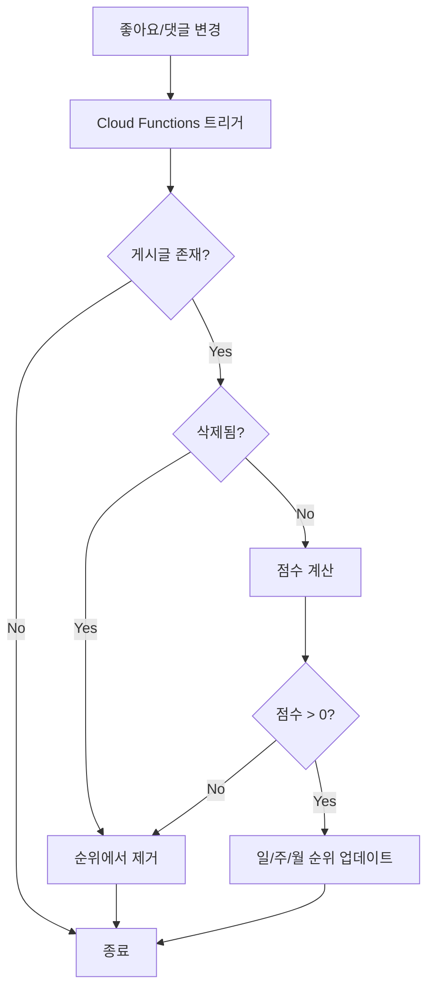
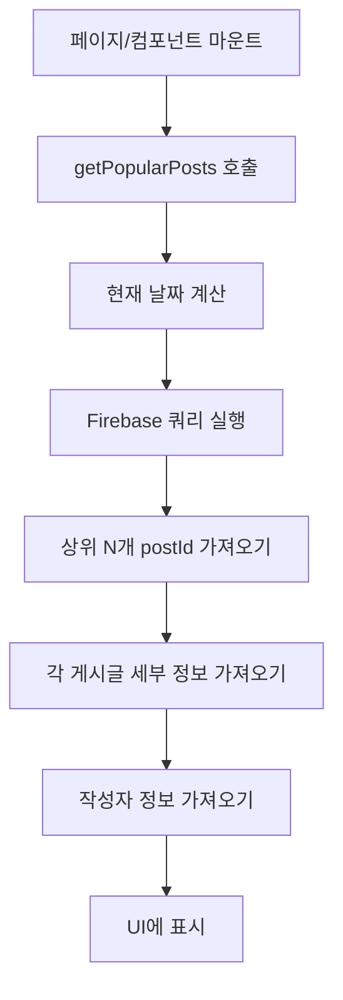

# 인기 게시글 시스템 사양서

## 1. 개요

### 1.1 목적

게시글의 좋아요와 댓글 수를 기반으로 인기 게시글 순위를 실시간으로 집계하고, 사용자에게 일별/주별/월별 인기 게시글을 제공하는 시스템입니다.

### 1.2 주요 기능

- **실시간 순위 집계**: 게시글의 좋아요/댓글 수 변경 시 자동으로 순위 업데이트
- **다중 기간 지원**: 일간(Daily), 주간(Weekly), 월간(Monthly) 순위 제공
- **점수 계산 시스템**: 좋아요 1점 + 댓글 2점으로 가중치 부여
- **상위 100개 표시**: 각 기간별 상위 100개 게시글 제공
- **우측 사이드바 위젯**: 오늘 일별 기준 상위 5개 게시글 미리보기

### 1.3 사용 사례

- 사용자가 가장 인기 있는 콘텐츠를 빠르게 발견
- 커뮤니티의 트렌딩 토픽 파악
- 양질의 콘텐츠 노출 증대

## 2. 데이터베이스 구조

상세한 데이터베이스 구조는 다음 문서를 참조하세요:
- [게시글 순위 데이터베이스 구조](./sonub-firebase-database-structure.md#게시글-순위-post-rankings)

### 2.1 Security Rules

**소스 코드 위치**: [post.functions.ts.md](./repository/src/lib/functions/post.functions.ts.md)

```json
"post-rankings": {
  ".read": "(auth != null)",
  ".write": false,
  "daily": {
    "$date": {
      ".indexOn": ".value"
    }
  },
  "weekly": {
    "$date": {
      ".indexOn": ".value"
    }
  },
  "monthly": {
    "$date": {
      ".indexOn": ".value"
    }
  }
}
```

**규칙 설명:**
- **`.read`**: 로그인한 사용자만 읽기 가능
- **`.write`**: `false` - 클라이언트에서 직접 쓰기 불가, Cloud Functions만 작성
- **`.indexOn`**: `.value`를 인덱싱하여 점수 기반 정렬 성능 최적화

## 3. Cloud Functions

### 3.1 트리거 구조

**소스 코드 위치**: [repository/firebase/functions/src/index.ts.md](./repository/firebase/functions/src/index.ts.md)

```typescript
// 게시글 좋아요 수 변경 시
export const onPostLikeCountWritten = onValueWritten({
  ref: "/posts/{postId}/likeCount",
  region: FIREBASE_REGION
}, handlePostRankingUpdate);

// 게시글 댓글 수 변경 시
export const onPostCommentCountWritten = onValueWritten({
  ref: "/posts/{postId}/commentCount",
  region: FIREBASE_REGION
}, handlePostRankingUpdate);

// 게시글 전체 댓글 수 변경 시
export const onPostTotalChildCountWritten = onValueWritten({
  ref: "/posts/{postId}/totalChildCount",
  region: FIREBASE_REGION
}, handlePostRankingUpdate);
```

### 3.2 핸들러 로직

**소스 코드 위치**: [repository/firebase/functions/src/handlers/post-ranking.handler.ts.md](./repository/firebase/functions/src/handlers/post-ranking.handler.ts.md)

#### 주요 함수: `handlePostRankingUpdate(postId: string)`

**수행 작업:**

1. **게시글 데이터 조회**
   - `/posts/{postId}` 노드에서 `likeCount`, `commentCount`, `deleted`, `roomId` 필드 읽기

2. **유효성 검증**
   - 게시글이 존재하지 않으면 종료
   - **채팅 메시지 기반 게시글 필터링**: `roomId` 필드가 존재하면 순위 업데이트를 건너뜀 (순수한 게시글만 Popular Posts에 포함)
   - 게시글이 삭제되었으면 순위에서 제거 (`removePostFromRankings()` 호출)

**채팅 메시지 필터링 로직:**

**소스 코드 위치**: [post-ranking.handler.ts:59-72](./repository/firebase/functions/src/handlers/post-ranking.handler.ts)

   ```typescript
   const roomId = postData.roomId; // 채팅 메시지 기반 post 여부
   const category = postData.category; // 카테고리 필드

   // 순수 채팅 메시지 (카테고리 없음)는 인기 순위에서 제외
   // roomId는 있지만 category가 없으면 → 순수 채팅 메시지이므로 제외
   // roomId와 category가 둘 다 있으면 → 카테고리가 추가된 채팅 메시지이므로 포함
   if (roomId && !category) {
     logger.info("카테고리 없는 순수 채팅 메시지는 인기 순위에 포함하지 않습니다", {
       postId,
       roomId,
       category,
     });
     return;
   }
   ```

**배경:**
- 채팅 메시지에 카테고리가 추가되면 `/posts/{postId}` 경로에도 저장됨 (dual storage)
- 이 post에는 `roomId`, `messageId`, `category` 필드가 포함됨
- **Popular Posts 포함 조건:**
  - ✅ `roomId` 없음 → 순수한 게시글 (포함)
  - ✅ `roomId` 있고 `category` 있음 → 카테고리가 추가된 채팅 메시지 (포함)
  - ❌ `roomId` 있고 `category` 없음 → 순수 채팅 메시지 (제외)

3. **점수 계산**

**소스 코드 위치**: [post.functions.ts.md](./repository/src/lib/functions/post.functions.ts.md)

   ```typescript
   const score = (likeCount * 1) + (commentCount * 2);
   ```

4. **점수 유효성 확인**
   - 점수가 0 이하면 순위에서 제거

5. **날짜 형식 생성**
   - `daily`: `yyyyMMdd` (예: 20251119)
   - `weekly`: `yyyyWww` (예: 2025W47, ISO week 기준)
   - `monthly`: `yyyyMM` (예: 202511)

6. **일별/주별/월별 순위 업데이트**

**소스 코드 위치**: [post.functions.ts.md](./repository/src/lib/functions/post.functions.ts.md)

   ```typescript
   const updates: Record<string, number> = {};
   updates[`post-rankings/daily/${daily}/${postId}`] = -score;
   updates[`post-rankings/weekly/${weekly}/${postId}`] = -score;
   updates[`post-rankings/monthly/${monthly}/${postId}`] = -score;

   await db.ref().update(updates);
   ```

#### 보조 함수: `removePostFromRankings(postId: string)`

삭제된 게시글이나 점수가 0 이하인 게시글을 모든 기간 순위에서 제거합니다.

**소스 코드 위치**: [post.functions.ts.md](./repository/src/lib/functions/post.functions.ts.md)

```typescript
const updates: Record<string, null> = {};
updates[`post-rankings/daily/${daily}/${postId}`] = null;
updates[`post-rankings/weekly/${weekly}/${postId}`] = null;
updates[`post-rankings/monthly/${monthly}/${postId}`] = null;

await db.ref().update(updates);
```

#### ISO Week 계산: `getISOWeek(date: Date)`

ISO 8601 기준으로 주 번호를 계산합니다.

- **주의 시작**: 월요일
- **1주차**: 1월 4일이 포함된 주
- **반환값**: 1-53

## 4. 클라이언트 구현

### 4.1 함수 라이브러리

**소스 코드 위치**: [repository/src/lib/functions/post.functions.ts.md](./repository/src/lib/functions/post.functions.ts.md)

#### `getPopularPosts(period, limit)`

인기 게시글 순위 데이터를 가져옵니다.

**매개변수:**
- `period`: `'daily' | 'weekly' | 'monthly'`
- `limit`: 가져올 게시글 수 (기본값: 100)

**반환값:**

**소스 코드 위치**: [post.functions.ts.md](./repository/src/lib/functions/post.functions.ts.md)

```typescript
Array<{ postId: string; score: number }>
```

**구현:**

**소스 코드 위치**: [post.functions.ts.md](./repository/src/lib/functions/post.functions.ts.md)

```typescript
const dateKey = formatDate(now, period);
const rankingsRef = ref(rtdb, `post-rankings/${period}/${dateKey}`);
const rankingsQuery = query(rankingsRef, orderByValue(), limitToFirst(limit));
```

#### `formatDate(date, period)`

날짜를 지정된 형식으로 변환합니다.

**형식:**
- `daily`: `yyyyMMdd` (20251119)
- `weekly`: `yyyyWww` (2025W47)
- `monthly`: `yyyyMM` (202511)

#### `getPostField(postId, field)` / `getPostFields(postId, fields)`

게시글의 특정 필드만 선택적으로 읽어와 RTDB 비용을 절감합니다.

**예시:**

**소스 코드 위치**: [post.functions.ts](/Users/thruthesky/apps/sonub/src/lib/functions/post.functions.ts)

```typescript
// 단일 필드
const text = await getPostField('post123', 'text');

// 여러 필드 (병렬 처리)
const data = await getPostFields('post123', ['text', 'authorUid', 'createdAt']);
```

### 4.2 인기 게시글 페이지

**소스 코드 위치**: [repository/src/routes/post/popular/+page.svelte.md](./repository/src/routes/post/popular/+page.svelte.md)

**경로**: `/post/popular`

**주요 기능:**

1. **기간 탭 선택**: 일간/주간/월간 전환
2. **상위 100개 게시글 표시**
3. **순위 배지**: 1-3위는 골드 그라데이션
4. **게시글 카드**: 제목, 작성자, 좋아요/댓글 수 표시
5. **점수 표시**: 각 게시글의 인기 점수

**UI 구조:**

**소스 코드 위치**: [post.functions.ts.md](./repository/src/lib/functions/post.functions.ts.md)

```svelte
<div class="popular-posts-page">
  <!-- 헤더 -->
  <div class="page-header">
    <h1>인기 게시글</h1>
    <p>좋아요와 댓글이 많은 인기 게시글을 확인하세요</p>
  </div>

  <!-- 기간 탭 -->
  <div class="period-tabs">
    <Button [일간] />
    <Button [주간] />
    <Button [월간] />
  </div>

  <!-- 게시글 목록 -->
  <div class="posts-list">
    {#each popularPosts as post}
      <div class="post-item">
        <div class="rank-badge">#{순위}</div>
        <PostCard />
        <div class="score-badge">{점수}</div>
      </div>
    {/each}
  </div>
</div>
```

### 4.3 PopularPostsCard 컴포넌트

**소스 코드 위치**: [repository/src/lib/components/sidebar/PopularPostsCard.svelte.md](./repository/src/lib/components/sidebar/PopularPostsCard.svelte.md)

**위치**: 우측 사이드바

**주요 기능:**

1. **오늘 일별 기준 상위 5개** 게시글 표시
2. **자동 로드**: 컴포넌트 마운트 시 데이터 로드
3. **클릭 이벤트**:
   - **"더보기" 버튼**: `/post/popular` 페이지로 이동
   - **게시글 클릭**: `/post/view/{postId}` 상세 페이지로 이동

**UI 구조:**

**소스 코드 위치**: [post.functions.ts.md](./repository/src/lib/functions/post.functions.ts.md)

```svelte
<div class="popular-posts-section">
  <!-- 헤더 -->
  <div class="section-header">
    <h3>인기 게시글</h3>
    <button>더보기</button>
  </div>

  <!-- 게시글 목록 (최대 5개) -->
  <div class="posts-list">
    {#each popularPosts as post, index}
      <button class="post-item">
        <div class="rank-badge">{index + 1}</div>
        <div class="post-info">
          <div class="post-title">{제목}</div>
          <div class="post-meta">
            <span>{작성자}</span>
            <div>❤️ {좋아요} 💬 {댓글}</div>
          </div>
        </div>
        <div class="score-badge">{점수}</div>
      </button>
    {/each}
  </div>
</div>
```

### 4.4 우측 사이드바 통합

**소스 코드 위치**: [repository/src/lib/components/right-sidebar.svelte.md](./repository/src/lib/components/right-sidebar.svelte.md)

PopularPostsCard를 우측 사이드바에 추가했습니다.

**순서:**
1. NotificationCard (알림)
2. **PopularPostsCard (인기 게시글)** ← 새로 추가
3. StatsCard (통계)
4. SuggestionsCard (추천)

## 5. 다국어 지원

### 5.1 메시지 키

모든 언어 파일(`messages/ko.json`, `messages/en.json`, `messages/ja.json`, `messages/zh.json`)에 다음 키들을 추가했습니다:

| 키 | 한국어 | 영어 | 일본어 | 중국어 |
|---|---|---|---|---|
| `인기_게시글` | 인기 게시글 | Popular Posts | 人気投稿 | 热门帖子 |
| `인기_게시글_설명` | 좋아요와 댓글이 많은 인기 게시글을 확인하세요 | Check out popular posts with lots of likes and comments | いいねやコメントが多い人気投稿をチェック | 查看点赞和评论数多的热门帖子 |
| `일간` | 일간 | Daily | 日間 | 每日 |
| `주간` | 주간 | Weekly | 週間 | 每周 |
| `월간` | 월간 | Monthly | 月間 | 每月 |
| `로딩중` | 로딩 중... | Loading... | 読み込み中... | 加载中... |
| `로그인이_필요합니다` | 로그인이 필요합니다 | Login required | ログインが必要です | 需要登录 |
| `인기_게시글이_없습니다` | 인기 게시글이 없습니다 | No popular posts | 人気投稿がありません | 没有热门帖子 |

### 5.2 사용 예시

**소스 코드 위치**: [post.functions.ts.md](./repository/src/lib/functions/post.functions.ts.md)

```svelte
import * as m from '$lib/paraglide/messages.js';

<h1>{m.인기_게시글()}</h1>
<p>{m.인기_게시글_설명()}</p>
```

## 6. 성능 최적화

### 6.1 RTDB 비용 절감

- **필요한 필드만 선택적으로 읽기**

**소스 코드 위치**: [post.functions.ts.md](./repository/src/lib/functions/post.functions.ts.md)

  ```typescript
  // ❌ 나쁜 예: 전체 노드 읽기
  const postRef = ref(rtdb, `posts/${postId}`);

  // ✅ 좋은 예: 필드별 개별 읽기
  await getPostFields(postId, ['title', 'text', 'authorUid']);
  ```

- **병렬 처리**

**소스 코드 위치**: [post.functions.ts.md](./repository/src/lib/functions/post.functions.ts.md)

  ```typescript
  // Promise.all()을 사용하여 여러 필드를 병렬로 읽기
  const promises = fields.map((field) => getPostField(postId, field));
  const values = await Promise.all(promises);
  ```

### 6.2 인덱싱

Firebase Database Rules에서 `.indexOn: ".value"`를 설정하여 점수 기반 정렬 쿼리 성능을 최적화했습니다.

### 6.3 제한된 데이터 로드

- **사이드바 위젯**: 상위 5개만 로드
- **전체 페이지**: 상위 100개만 로드
- `limitToFirst(N)`을 사용하여 필요한 만큼만 데이터 가져오기

## 7. 워크플로

### 7.1 순위 업데이트 플로우

**소스 코드 위치**: [post.functions.ts.md](./repository/src/lib/functions/post.functions.ts.md)



### 7.2 클라이언트 데이터 로드 플로우

**소스 코드 위치**: [post.functions.ts.md](./repository/src/lib/functions/post.functions.ts.md)



## 8. 배포 및 테스트

### 8.1 Cloud Functions 배포

**소스 코드 위치**: [post.functions.ts.md](./repository/src/lib/functions/post.functions.ts.md)

```bash
cd firebase/functions
npm run deploy
```

**배포되는 함수:**
- `onPostLikeCountWritten`
- `onPostCommentCountWritten`
- `onPostTotalChildCountWritten`

### 8.2 테스트 시나리오

#### 시나리오 1: 좋아요 추가

1. 게시글에 좋아요 추가
2. `/posts/{postId}/likeCount` 증가
3. Cloud Functions 트리거 실행
4. 점수 재계산: `(likeCount × 1) + (commentCount × 2)`
5. `/post-rankings/{period}/{date}/{postId}` 업데이트
6. 클라이언트에서 인기 게시글 목록 새로고침 시 반영됨

#### 시나리오 2: 댓글 추가

1. 게시글에 댓글 작성
2. `/posts/{postId}/commentCount` 증가
3. Cloud Functions 트리거 실행
4. 점수 재계산 (댓글 2점 반영)
5. 순위 업데이트

#### 시나리오 3: 게시글 삭제

1. 게시글 삭제 (`deleted: true`)
2. Cloud Functions 트리거 실행
3. `removePostFromRankings()` 호출
4. 모든 기간 순위에서 제거

#### 시나리오 4: 인기 게시글 조회

1. `/post/popular` 페이지 접속
2. 일간 탭 선택
3. `getPopularPosts('daily', 100)` 호출
4. 상위 100개 게시글 ID 및 점수 반환
5. 각 게시글의 세부 정보 로드
6. 순위와 함께 UI에 표시

#### 시나리오 5: 채팅 메시지 카테고리 추가 후 삭제

**문제 상황 (수정 전):**
1. 채팅 메시지에 카테고리 추가 → `/posts/{postId}` 생성 (`category`, `roomId` 필드 포함)
2. 사용자가 카테고리 삭제 → `/chat-messages/` 필드만 삭제
3. **문제**: `/posts/{postId}`는 삭제되지 않고 그대로 남음
4. **결과**: `roomId`는 있지만 `category`가 없는 post가 Popular Posts에 표시됨

**수정 후 (현재 동작):**

**소스 코드 위치**: [chat.message-category.handler.ts:254-310](./repository/firebase/functions/src/handlers/chat.message-category.handler.ts)

1. 채팅 메시지에 카테고리 추가 → `/posts/{postId}` 생성
2. 사용자가 카테고리 삭제
3. `handleChatMessageCategoryDelete` 함수 실행:
   - 채팅 메시지에서 `postId` 조회
   - 채팅 메시지 필드 삭제: `categoryOrder`, `allCategoryOrder`, `type`, `postId`, `order`
   - **`/posts/{postId}` 노드 전체 삭제** (추가됨)
4. **결과**: 순수 채팅 메시지로 복원, Popular Posts에서 자동 제거

```typescript
// 카테고리 삭제 핸들러 수정 사항
export async function handleChatMessageCategoryDelete(
  roomId: string,
  messageId: string
): Promise<void> {
  // 1. 채팅 메시지에서 postId 조회
  const messageRef = admin.database().ref(`chat-messages/${roomId}/${messageId}/postId`);
  const postIdSnapshot = await messageRef.once("value");
  const postId = postIdSnapshot.val();

  // 2. 채팅 메시지 필드 삭제
  const updates: {[key: string]: null} = {
    [`chat-messages/${roomId}/${messageId}/categoryOrder`]: null,
    [`chat-messages/${roomId}/${messageId}/allCategoryOrder`]: null,
    [`chat-messages/${roomId}/${messageId}/type`]: null,
    [`chat-messages/${roomId}/${messageId}/postId`]: null,
    [`chat-messages/${roomId}/${messageId}/order`]: null,
  };

  // 3. postId가 있으면 /posts/{postId} 노드 전체 삭제 ← 추가됨!
  if (postId) {
    updates[`posts/${postId}`] = null;
  }

  await admin.database().ref().update(updates);
}
```

### 8.3 예상 결과

- **좋아요/댓글 변경 후 1-2초 내** 순위 업데이트
- **삭제된 게시글**은 자동으로 순위에서 제거
- **인기 게시글 페이지**에서 실시간 반영된 순위 확인 가능
- **우측 사이드바**에서 오늘의 인기 게시글 5개 표시

## 9. 에러 처리

### 9.1 Cloud Functions

- 게시글이 존재하지 않으면 경고 로그 출력 후 종료
- 순위 업데이트 실패 시 에러 로그 출력 (비치명적, throw 안 함)
- 모든 에러는 `logger.error()`로 기록

### 9.2 클라이언트

- 데이터 로드 실패 시 빈 배열 반환
- 콘솔에 에러 메시지 출력
- UI에서는 "인기 게시글이 없습니다" 메시지 표시

## 10. 향후 개선 사항

### 10.1 캐싱

- 클라이언트에서 인기 게시글 데이터를 로컬 캐싱
- 5-10분 간격으로 자동 새로고침

### 10.2 시간 가중치

- 최근 게시글에 더 높은 가중치 부여
- 예: 시간 경과에 따라 점수 감소 (decay factor)

### 10.3 카테고리별 인기 게시글

- 각 포럼 카테고리별로 별도의 인기 순위 제공
- `/post-rankings/{category}/{period}/{date}/{postId}`

### 10.4 실시간 업데이트

- 클라이언트에서 Firebase 실시간 구독
- 순위 변동 시 자동으로 UI 업데이트

### 10.5 통계 대시보드

- 인기 게시글 트렌드 차트
- 시간대별/요일별 인기 게시글 분석

## 11. 시간 기반 정렬 (Time-based Sorting)

### 11.1 음수 타임스탬프 패턴

게시글 목록을 최신순으로 정렬하기 위해 **음수 타임스탬프**를 사용합니다. 이는 Firebase Realtime Database의 사전순(lexicographical) 정렬 특성을 활용한 최적화 패턴입니다.

### 11.2 적용 필드

- **`categoryOrder`**: `"{category}-{-timestamp}"` 형식 (예: `"qna--1700000000000"`)
- **`allCategoryOrder`**: `-timestamp` 음수 타임스탬프 (예: `-1700000000000`)

### 11.3 정렬 원리

Firebase RTDB는 문자열을 **사전순(lexicographical)**으로 정렬합니다:

**양수 타임스탬프 문제:**

**소스 코드 위치**: [post.functions.ts.md](./repository/src/lib/functions/post.functions.ts.md)

```
"qna-1234567890" < "qna-9999999999"
```
- 사전순으로는 맞지만, 시간순으로는 오래된 글이 먼저 표시됨
- `reverse=true`를 사용해도 페이지네이션 커서 로직이 깨짐

**음수 타임스탬프 해결:**

**소스 코드 위치**: [post.functions.ts.md](./repository/src/lib/functions/post.functions.ts.md)

```
"qna--9999999999" < "qna--1234567890"
```
- 더 작은 음수 = 더 최신 글
- Firebase의 오름차순 정렬이 자연스럽게 최신순을 생성
- 페이지네이션 로직이 정확하게 작동

### 11.4 구현 위치

**Cloud Functions:**
- [firebase/functions/src/handlers/post.create.handler.ts](./repository/firebase/functions/src/handlers/post.create.handler.ts)

**소스 코드 위치**: [post.functions.ts.md](./repository/src/lib/functions/post.functions.ts.md)

  ```typescript
  // 음수 타임스탬프 사용
  const categoryOrder = `${category}-${-Number(createdAt)}`;
  const allCategoryOrder = -Number(createdAt);
  ```

- [firebase/functions/src/handlers/chat.message-category.handler.ts](./repository/firebase/functions/src/handlers/chat.message-category.handler.ts)

**소스 코드 위치**: [post.functions.ts.md](./repository/src/lib/functions/post.functions.ts.md)

  ```typescript
  // 채팅 메시지를 게시글로 변환할 때
  const categoryOrder = createCategoryOrder(category, timestamp);
  const allCategoryOrder = -timestamp;
  ```

**Shared Library:**
- [shared/categories.ts](./repository/shared/categories.ts)

**소스 코드 위치**: [post.functions.ts.md](./repository/src/lib/functions/post.functions.ts.md)

  ```typescript
  export function createCategoryOrder(
    category: ForumCategory,
    timestamp: number
  ): string {
    return `${category}-${-timestamp}`;
  }
  ```

### 11.5 장점

1. **자연스러운 정렬**: Firebase의 기본 오름차순 정렬만으로 최신순 표시
2. **페이지네이션 안정성**: `limitToLast()` + `reverse()` 조합 없이 커서 로직 정확
3. **성능 최적화**: 클라이언트 측 재정렬 불필요
4. **일관성**: 모든 게시글 목록에서 동일한 정렬 방식 적용

## 12. 관련 파일 목록

### 12.1 Backend (Cloud Functions)

- [firebase/functions/src/handlers/post-ranking.handler.ts](./repository/firebase/functions/src/handlers/post-ranking.handler.ts)
- [firebase/functions/src/index.ts](./repository/firebase/functions/src/index.ts) (lines 1628-1697)

### 12.2 Frontend (Client)

- [src/lib/functions/post.functions.ts](./repository/src/lib/functions/post.functions.ts)
- [src/routes/post/popular/+page.svelte](./repository/src/routes/post/popular/+page.svelte)
- [src/lib/components/sidebar/PopularPostsCard.svelte](./repository/src/lib/components/sidebar/PopularPostsCard.svelte)
- [src/lib/components/right-sidebar.svelte](./repository/src/lib/components/right-sidebar.svelte)

### 12.3 Database & Security

- [firebase/database.rules.json](./repository/firebase/database.rules.json) (post-rankings section)

### 12.4 다국어

- [messages/ko.json](./repository/messages/ko.json)
- [messages/en.json](./repository/messages/en.json)
- [messages/ja.json](./repository/messages/ja.json)
- [messages/zh.json](./repository/messages/zh.json)

## 13. 참고 자료

- [Firebase Realtime Database 문서](https://firebase.google.com/docs/database)
- [Firebase Cloud Functions (Gen 2) 문서](https://firebase.google.com/docs/functions/2nd-gen)
- [ISO 8601 Week Date](https://en.wikipedia.org/wiki/ISO_week_date)
- [SvelteKit Routing](https://kit.svelte.dev/docs/routing)
- [Tailwind CSS 문서](https://tailwindcss.com/docs)

---

**문서 작성자**: Claude Code
**최종 업데이트**: 2025-11-19
**버전**: 1.0.0
